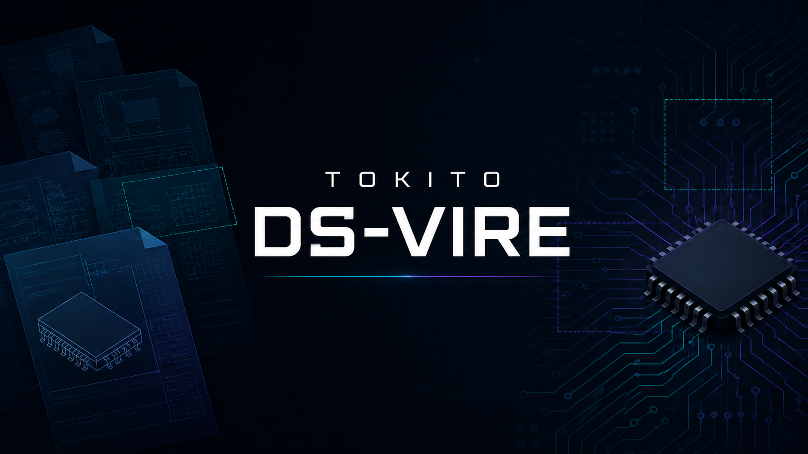
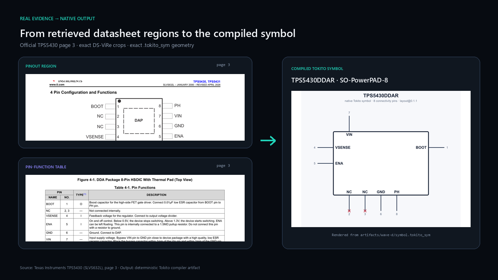
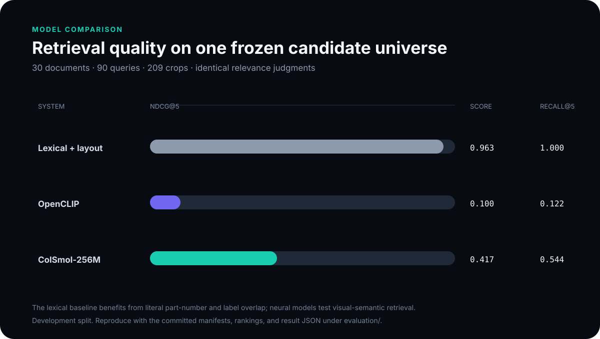

# DS-ViRe

**Figure-level retrieval for semiconductor datasheets.**

DS-ViRe finds the exact pinout, pin-function table, package drawing, timing
diagram, curve, or application circuit an engineer needs—and returns it as
typed, hash-bound evidence instead of an ungrounded answer or an entire PDF
page.



## From datasheet evidence to a usable symbol



The left side contains the actual pinout and pin-function-table crops retrieved
from page 3 of the official TPS5430 datasheet. The right side is rendered from
the exact compiled `symbol.tokito_sym` artifact—not a hand-redrawn symbol.
DS-ViRe owns retrieval and provenance; Tokito's extractor reads approved crops,
and deterministic Rust code owns symbol geometry and serialization.

## Why DS-ViRe

Text-only RAG works poorly when the answer is a drawing. Page-level visual
retrieval improves recall, but an engineer still needs the exact figure and its
identity context. DS-ViRe narrows the unit of retrieval to figures and tables,
then binds every result to:

- the exact datasheet hash and part identity;
- a page and normalized bounding box;
- a typed region and crop hash;
- an explicit verification method and score meaning.

Callers cannot turn heuristic similarity into publication authority. Unknown,
ambiguous, malformed, or mismatched inputs stop at a typed boundary.

## Install

Requires Python 3.11+ and [uv](https://docs.astral.sh/uv/) 0.12.3.

```bash
git clone https://github.com/TokitoAI/tokito-dsvire.git
cd tokito-dsvire
uv sync --locked --extra test
```

Extract evidence from a local datasheet:

```bash
uv run --frozen --no-sync dsvire extract-evidence datasheet.pdf \
  --manufacturer "Texas Instruments" \
  --mpn TPS5430DDAR \
  --package SO-PowerPAD-8 \
  --out ./artifacts
```

DS-ViRe never infers the requested identity from a filename. Manufacturer, MPN,
and package are caller hypotheses that must be independently grounded in the
document.

## Use as a private service

```bash
export DSVIRE_ENVIRONMENT=production
export DSVIRE_SERVICE_TOKEN="replace-with-at-least-32-random-bytes"
uv run --frozen --no-sync uvicorn dsvire.api:app --host 127.0.0.1 --port 8081
```

Send raw `application/pdf` bytes to `POST /v1/evidence/symbol` with exact
`manufacturer`, `mpn`, and `package` query parameters and a bearer token.
Production refuses to start without authentication. PDF work runs in disposable
subprocesses with bounded admission, time, memory, output, and file size.

See [Usage](docs/USAGE.md) for the complete CLI, service, model, and dependency
workflow.

## Architecture

```text
PDF + exact part hypothesis
        │
        ▼
strict PDF boundary ── identity and package grounding
        │
        ▼
page render ── region proposals ── hybrid retrieval ── verification
        │
        ▼
typed evidence pack: page + bbox + crop hash + provenance
        │
        ├── retrieval API / benchmark consumers
        └── Tokito extraction → validated SymbolSpec → deterministic compiler
```

Heavy parsing and indexing stay off the interactive query path. Packs are
content- and model-versioned; late-interaction MaxSim is bounded to a small
candidate set. The complete design and SLO rationale are in the
[Technical Architecture](docs/TECHNICAL_BIBLE.md).

The target product is independently usable through a CLI, authenticated HTTP
API, MCP tools, a hosted upload/review/download flow, and a contract-equivalent
self-hosted stack. Tokito is a first-class client, not the only execution path.
Postgres owns durable workflow and catalog state; object storage owns source and
artifact bytes; Qdrant owns rebuildable retrieval indexes; Redis-compatible
infrastructure is ephemeral acceleration; verified immutable SQLite packs
remain the catalog delivery and rollback format. See the
[Standalone Service Architecture](docs/SERVICE_ARCHITECTURE.md). These are
target boundaries, not a claim that the hosted standalone surface has shipped.

## Measured baseline



Current evidence is useful but not a production-accuracy claim:

| Measurement | Result | Scope |
|---|---:|---|
| Corpus | 40 families, 279 regions | Source-free registry; 30 development, 5 calibration, 5 evaluation |
| ColSmol development nDCG@5 | 0.417 | 90 template development queries over 209 candidates |
| ColSmol development R@5 | 0.544 | Same closed development universe |
| Target GPU MaxSim p95 | 254 ms | GTX 1650, top-32 candidate cap |
| Held-out safety | 0 wrong figures / identities accepted | Previous frozen cycle |
| Held-out positive coverage | 46.7% | Missed the frozen 50% floor; publication stayed disabled |

The benchmark graphic and numbers are generated from committed JSON evidence.
See [Evaluation](evaluation/README.md) for data provenance, split isolation,
leakage controls, and exact reproduction commands.

The separate training-corpus registry now contains 635 verified manufacturer
datasheets (25,324 pages) plus 2,393 licensed DocLayNet auxiliary pages. Its
public metadata, hashes, weak-label tiers, source review, and contribution
workflow live under [`datasets/corpus-v1`](datasets/corpus-v1/). These training
candidates are not mixed into the frozen benchmark splits.

## Project status

The deterministic baseline, authenticated service boundary, retrieval packs,
hybrid query core, ColSmol adapter, reproducible builds, and Tokito integration
contracts are implemented. Automated catalog publication remains disabled
until a new preregistered cycle receives genuine independent human review and
passes its frozen held-out quality gates.

See [Project status](docs/STATUS.md) for supported capabilities and remaining
gates. The [GitHub project](https://github.com/orgs/TokitoAI/projects/1) is the
live roadmap.

## Documentation

- [Usage](docs/USAGE.md) — CLI, service deployment, models, and verification
- [Technical architecture](docs/TECHNICAL_BIBLE.md) — system design, retrieval cascade, packs, and SLOs
- [Standalone service architecture](docs/SERVICE_ARCHITECTURE.md) — product surfaces, store ownership, publication, caching, tenancy, and deployment
- [Tokito integration](docs/TOKITO_SYMBOL_PIPELINE.md) — evidence-to-symbol responsibility boundaries
- [Contracts](docs/CONTRACTS.md) — versioned machine-facing schemas
- [Evaluation](evaluation/README.md) — corpus, benchmark, and leakage policy
- [Training datasets](datasets/README.md) — provenance manifests, data card, and contribution workflow
- [Project status](docs/STATUS.md) — implemented surface and honest remaining gates
- [Contributing](CONTRIBUTING.md) and [security policy](SECURITY.md)

## Reproduce the release gate

```bash
uv run --frozen --no-sync python scripts/generate_docs_assets.py
uv run --frozen --no-sync python scripts/verify_release.py \
  --json-out release-verification.json
```

The release verifier checks dependency locks, strict typing, lint and format,
tests, generated documentation assets, hostile-PDF/resource behavior, runtime
licenses, package construction, and known vulnerabilities.

## License

Apache-2.0. See [LICENSE](LICENSE) and [NOTICE](NOTICE).

Manufacturer PDFs and model weights are download-only and are never
redistributed by this repository. The workflow image includes only the two
small factual regions needed to demonstrate grounded retrieval; evaluation
fixtures otherwise use source-free hashes, geometry, annotations, and results.

If you use DS-ViRe in research, see [CITATION.cff](CITATION.cff).
