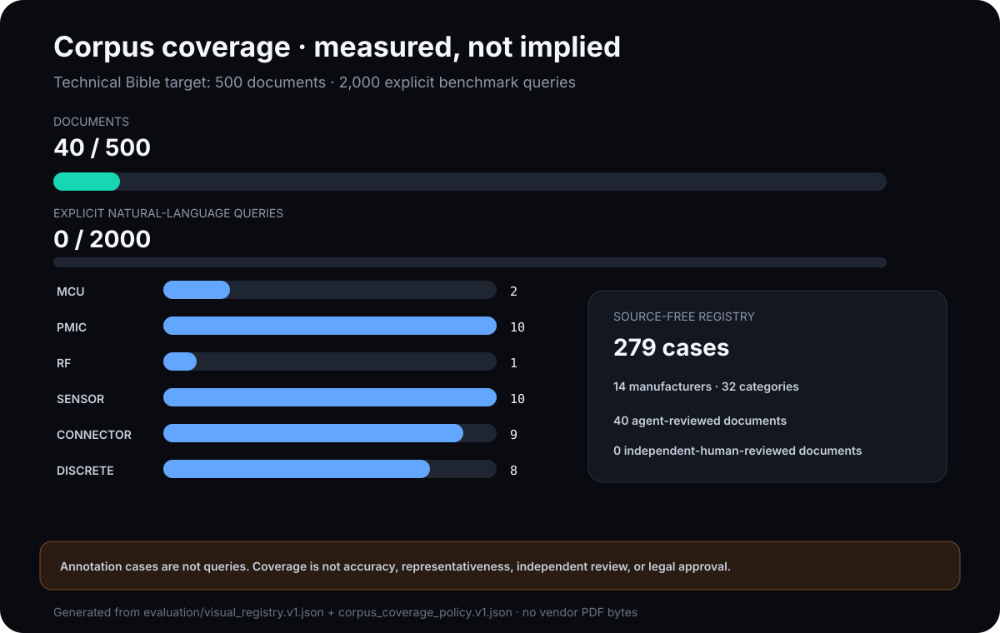
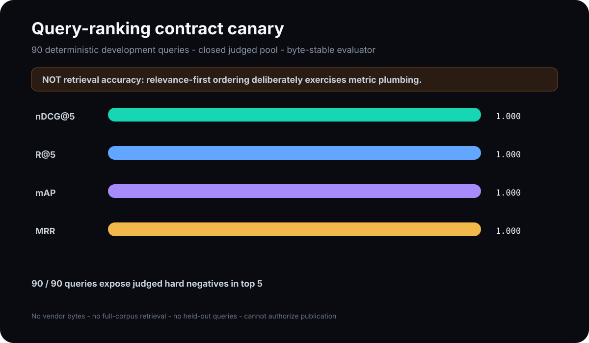
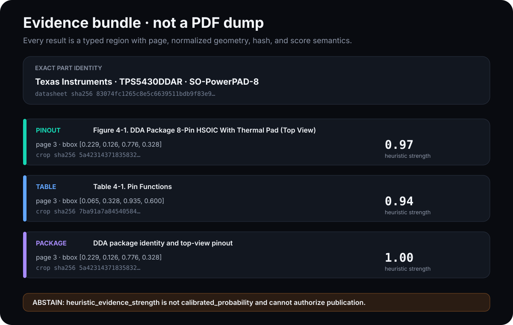
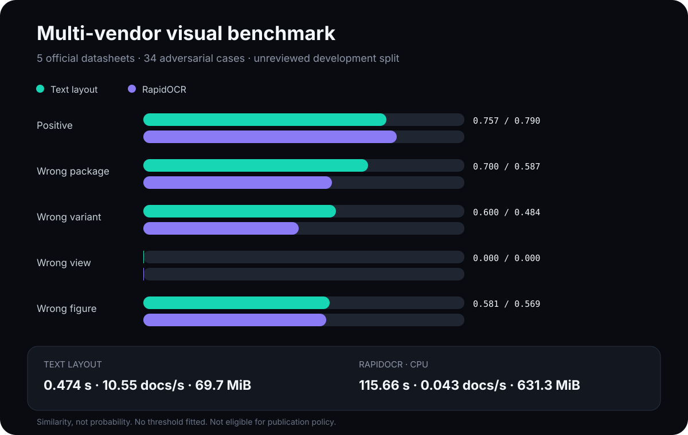
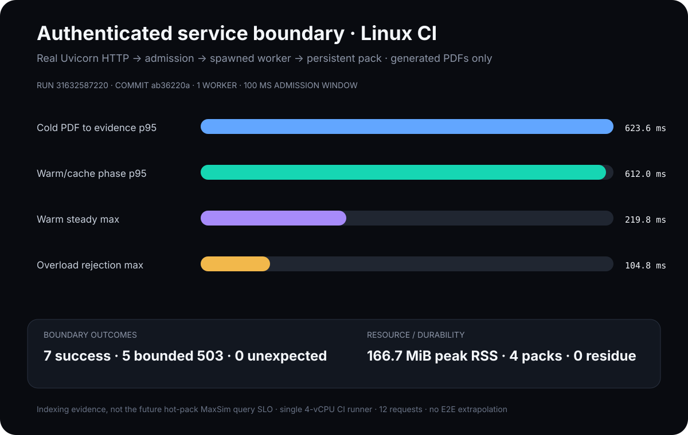

# Reproducible examples

These examples are for engineers evaluating DS-ViRe and for maintainers writing
technical posts about it. Every number and visual below is generated from a
committed JSON artifact. Vendor PDFs and rendered datasheet crops are not
redistributed.

Regenerate all public examples:

```bash
python scripts/generate_docs_assets.py
git diff --exit-code -- examples docs/assets
```

CI performs the same byte comparison in a temporary directory. Do not edit the
generated JSON or SVG files by hand.

## Corpus coverage ledger



The generated [coverage report](../examples/corpus-coverage.json) evaluates the
canonical visual and explicit-query registries against the versioned
[`corpus_coverage_policy.v1.json`](../evaluation/corpus_coverage_policy.v1.json).
It currently records 40 of 500 target documents, 90 of 2,000 explicit
natural-language benchmark queries, 279 visual annotation cases, 14
manufacturers, and 32 component categories. Development, calibration, and
evaluation counts remain separate, and the policy rejects category strata it
cannot account for.

The strict [`query_registry.v2.json`](../evaluation/query_registry.v2.json)
contains three deterministic-template development queries for each of the 30
development families: pinout, pin-function table, and package drawing. Every
query binds to a positive case in the same document family, split, and intent;
crop annotations are not silently promoted into queries. These 90 records are
not manual, independently reviewed, calibration, or held-out data. The
report also records zero independent-human-reviewed documents because the 40
current records were owner-authorized agent audits. Coverage does not establish
accuracy, representative sampling, legal approval, or publication readiness.

Regenerate the ledger directly with:

```bash
python scripts/audit_corpus_coverage.py \
  --json-out examples/corpus-coverage.json
```

## Query-ranking measurement contract



Query registry v2 binds every prompt to graded relevant regions and explicit
same-family adversarial regions. An external retriever writes a digest-bound
[`dsvire.query-ranking.v1`](../scripts/schema/query_ranking_v1.schema.json)
artifact, and the model-independent evaluator reports nDCG@5, R@5, mAP, MRR,
coverage/abstention, and hard-negative exposure:

```bash
python scripts/evaluate_query_rankings.py ranking.json \
  --json-out query-ranking-result.json
```

The committed [ranking canary](../examples/query-ranking-canary.json) is
deliberately relevance-first. Its perfect scores prove only that the schemas,
binding checks, metric equations, CLI, and documentation regeneration agree.
It operates over each query's closed judged pool; it performs no PDF retrieval,
contains no vendor bytes, is development-only, and is not an accuracy result.
Full-corpus comparisons require independently reviewed held-out queries and
actual system rankings.

## Tokito Wave D product acceptance

The checked [Wave D acceptance report](../examples/wave-d-acceptance.json) is
the output of a single local run across five sibling repositories. It passes
the frozen eight-pin TPS5430DDAR spec through:

1. the real deterministic catalog compiler;
2. authenticated `POST /v1/generated/ingest` on a local Tokito Cloud process;
3. the immutable `generated.sqlite` publication store;
4. `tokito-mcp-pack generated` and a real MCP streamable-HTTP server;
5. `resolve_by_mpn` and `get_symbol_provenance`; and
6. Desktop import, placement, canonical-core commit, save/reopen, hydration,
   and byte-identical embedded `.tokito_sym` verification.

```bash
python scripts/wave_d_acceptance.py
```

The report records exact repository commits, stage timings, total runtime,
artifact SHA-256 digests, and all 29 contract findings. The checked run has
every finding passing. MCP returned all eight pins, the generated namespace,
the TI datasheet URL, package and MPN metadata, plus the two cited evidence
region IDs. Read timing values from the report itself so regenerated evidence
cannot diverge from this narrative.

This is a seeded integration acceptance, not a live extraction score. The
checked `fixtures/acceptance` pair is explicitly marked as frozen EGVV input;
it does not replace held-out calibration, the live visual extractor, or the
separate credential/deployment gate in the production-readiness ledger.

## Evidence bundle walkthrough



The generated [evidence summary](../examples/tps5430ddar-evidence-summary.json)
is derived from the schema-validated
[`dsvire.symbol-evidence.v2`](../fixtures/evidence/tps5430ddar.json) fixture. It
demonstrates the boundary DS-ViRe gives a downstream client:

- exact manufacturer, orderable MPN, and package identity;
- typed `pinout`, `table`, and `package` regions instead of a whole PDF page;
- one-based page number and normalized `[x0, y0, x1, y1]` geometry;
- a content hash for each rendered crop;
- the method, policy version, outcome, numerical score, and score semantics.

The values `0.97`, `0.94`, and `1.00` are
`heuristic_evidence_strength`. They are not probabilities. The example sets
`publication_eligible` to `false` because the Technical Bible permits automated
publication only after an independently reviewed, held-out-calibrated
`evidence_gated_visual` policy passes its SLO. An `accepted` heuristic region
means the deterministic baseline found evidence; it does not mean EGVV has
verified the crop.

This fixture is a stable contract sample, not a current production extraction
or benchmark result. Its source identity and hashes are frozen so schema and
downstream compatibility can be tested without committing copyrighted bytes.

## Development comparator benchmark



The graph is generated from
[`multivendor-development-2026-08-12.json`](../evaluation/results/multivendor-development-2026-08-12.json),
a frozen five-document, 34-case development snapshot. It is intentionally
smaller than the living registry. The snapshot preserves a reproducible
comparison while the registry grows.

| Measurement | Text layout | RapidOCR |
|---|---:|---:|
| Elapsed time | 0.527 s | 116.12 s |
| Throughput | 9.49 docs/s | 0.043 docs/s |
| Peak RSS | 69.4 MiB | 632.8 MiB |
| Positive mean similarity | 0.763 | 0.796 |
| Wrong-package mean similarity | 0.700 | 0.587 |
| Wrong-variant mean similarity | 0.600 | 0.484 |
| Wrong-figure mean similarity | 0.581 | 0.569 |

RapidOCR improved package and variant separation in this slice, but the
wrong-package and wrong-figure scores remain too close to positives for a safe
standalone verifier. No threshold was fitted. Both adapters report similarity,
not calibrated probability, and this owner-authorized agent-audited development result is
ineligible for calibration or publication policy.

To produce a fresh local comparator result from official, hash-pinned sources:

```bash
python scripts/evaluate_visual.py \
  --cache-dir .cache/dsvire-eval \
  --adapter text-layout \
  --json-out visual-text-layout.json
```

Use `--offline` after the exact PDFs are cached. A vendor URL that returns
different bytes is an error requiring source revision review; the runner never
silently accepts the new document.

## Authenticated service load evidence



The source-free summary
[`service-load-linux-2026-08-12.json`](../evaluation/results/service-load-linux-2026-08-12.json)
is derived from the schema-validated artifact published by GitHub Actions run
[`31632587220`](https://github.com/TokitoAI/tokito-dsvire/actions/runs/31632587220).
It binds exact commit `ab36220afb0b1f5bbcea82a62633c5fc52f1dd47`, workload
digest `a438fcd...b24ff`, full artifact digest `4e7a7cf...f799`, the runner
environment, service limits, and these measurements:

| Phase | Result |
|---|---:|
| Cold PDF-to-evidence p95 | 623.588 ms (2/2 success) |
| Warm/cache phase p95 | 612.045 ms (4/4 success) |
| Warm steady cached samples | 202.818–219.750 ms |
| Overload | 1 progress, 5 HTTP 503 rejections in 102.610–104.796 ms |
| Peak Uvicorn + worker process-tree RSS | 174,796,800 bytes (166.7 MiB) |
| Durable output | 4 packs, 261,650 bytes, zero scratch/partial residue |

This deliberately starts a real Uvicorn process and crosses bearer
authentication, TCP request parsing, bounded admission, the spawned PDF worker,
pack creation/cache validation, and shutdown cleanup. The input is a
deterministic generated two-page PDF, so it redistributes no vendor content.

The Technical Bible's 800 ms p95 target applies to the future hot-pack MaxSim
query path. This run measures synchronous PDF-to-evidence indexing, so its SLO
verdict is `not_applicable`; the latency is evidence, not a claim that the
future query SLO passes. It also excludes Cloud upload/blob I/O, extraction,
catalog publication, Companion projection, client network latency, and soak.

Run the same harness locally with:

```bash
uv run --frozen --no-sync python scripts/evaluate_service_load.py \
  --cold-requests 2 --warm-requests 4 --overload-requests 6 \
  --source-commit "$(git rev-parse HEAD)" \
  --json-out service-load-evidence.json
```

## Inspecting a result safely

When consuming an evidence region, interpret these fields together:

```json
{
  "type": "pinout",
  "page": 3,
  "bbox_norm": [0.229, 0.126, 0.776, 0.328],
  "verification": {
    "method": "text_layout_heuristic",
    "outcome": "accepted",
    "score": 0.97,
    "score_semantics": "heuristic_evidence_strength"
  }
}
```

Never branch on `score` without also checking `method`, `policy_version`,
`outcome`, and `score_semantics`. A future calibrated probability belongs to a
different method and frozen policy artifact; raw similarity and heuristic
strength must not be relabelled as confidence.

## What the examples do not prove

They do not prove production accuracy, the 2% verified-path wrong-figure SLO,
or zero wrong-variant acceptance. Those require independently reviewed,
family-isolated calibration/evaluation splits and a policy frozen before the
held-out run. Current evidence and missing gates are tracked in
[`PRODUCTION_READINESS.md`](PRODUCTION_READINESS.md).
