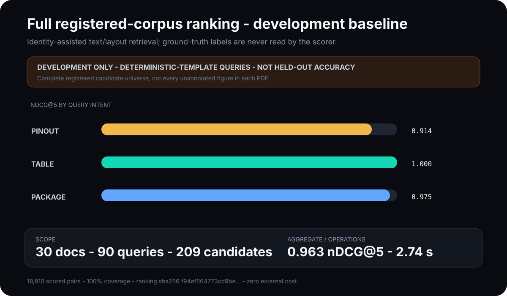
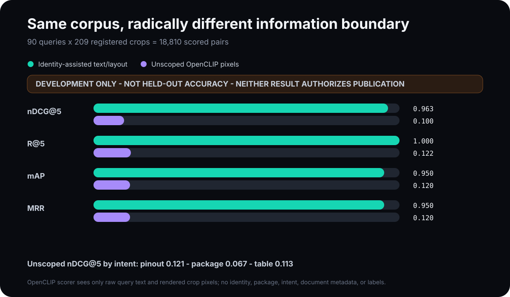
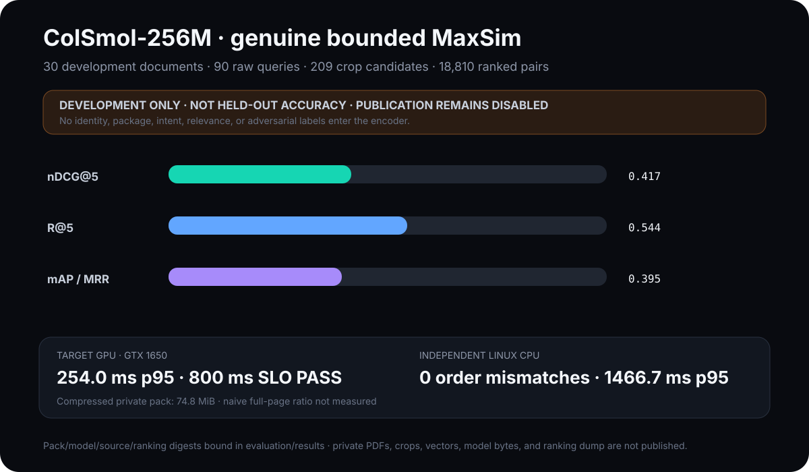
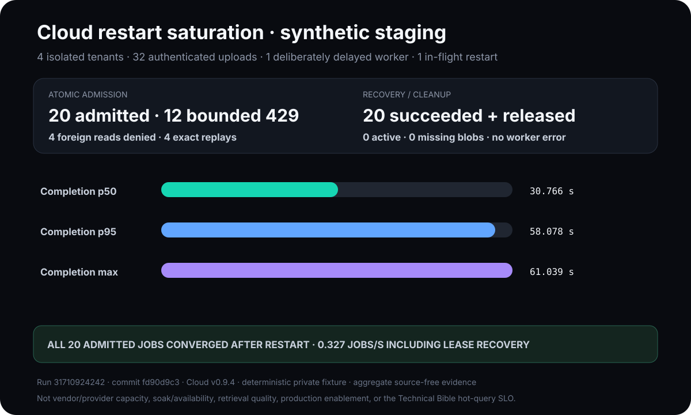
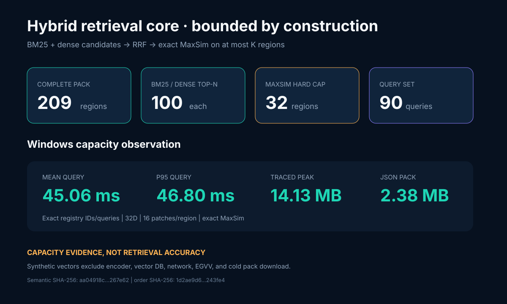

# Reproducible examples

These examples are for engineers evaluating DS-ViRe and for maintainers writing
technical posts about it. Every number and visual below is generated from a
committed JSON artifact. Vendor PDFs and rendered datasheet crops are not
redistributed.

Regenerate all public examples:

```bash
python scripts/generate_docs_assets.py
git diff --exit-code -- examples docs/assets
```

CI performs the same byte comparison in a temporary directory. Do not edit the
generated JSON or SVG files by hand.

## Corpus coverage ledger


The generated [coverage report](../examples/corpus-coverage.json) evaluates the
canonical visual and explicit-query registries against the versioned
[`corpus_coverage_policy.v1.json`](../evaluation/corpus_coverage_policy.v1.json).
It currently records 40 of 500 target documents, 90 of 2,000 explicit
natural-language benchmark queries, 279 visual annotation cases, 14
manufacturers, and 32 component categories. Development, calibration, and
evaluation counts remain separate, and the policy rejects category strata it
cannot account for.

The strict [`query_registry.v2.json`](../evaluation/query_registry.v2.json)
contains three deterministic-template development queries for each of the 30
development families: pinout, pin-function table, and package drawing. Every
query binds to a positive case in the same document family, split, and intent;
crop annotations are not silently promoted into queries. These 90 records are
not manual, independently reviewed, calibration, or held-out data. The
report also records zero independent-human-reviewed documents because the 40
current records were owner-authorized agent audits. Coverage does not establish
accuracy, representative sampling, legal approval, or publication readiness.

Regenerate the ledger directly with:

```bash
python scripts/audit_corpus_coverage.py \
  --json-out examples/corpus-coverage.json
```

## Query-ranking measurement contract


Query registry v2 binds every prompt to graded relevant regions and explicit
same-family adversarial regions. An external retriever writes a digest-bound
[`dsvire.query-ranking.v1`](../scripts/schema/query_ranking_v1.schema.json)
artifact, and the model-independent evaluator reports nDCG@5, R@5, mAP, MRR,
coverage/abstention, and hard-negative exposure:

```bash
python scripts/evaluate_query_rankings.py ranking.json \
  --json-out query-ranking-result.json
```

The committed [ranking canary](../examples/query-ranking-canary.json) is
deliberately relevance-first. Its perfect scores prove only that the schemas,
binding checks, metric equations, CLI, and documentation regeneration agree.
It operates over each query's closed judged pool; it performs no PDF retrieval,
contains no vendor bytes, is development-only, and is not an accuracy result.
Full-corpus comparisons require independently reviewed held-out queries and
actual system rankings.

## Full-corpus text/layout development baseline



The compact, source-free
[`full-corpus-text-pdfium-development-2026-08-13.json`](../evaluation/results/full-corpus-text-pdfium-development-2026-08-13.json)
is the first actual system ranking through the complete-split contract. It
extracts text once from each registered crop in 30 exact hash-pinned development
PDFs, then ranks all 209 registered candidates for each of 90 queries: 18,810
scored pairs with no missing, duplicate, injected, cross-split, non-finite, or
unsorted candidates.

| Measurement | Result |
|---|---:|
| Aggregate nDCG@5 | 0.9631 |
| R@5 | 1.0000 |
| mAP / MRR | 0.9500 / 0.9500 |
| Pinout / table / package nDCG@5 | 0.9139 / 1.0000 / 0.9754 |
| Coverage | 90 / 90 queries |
| Judged / unjudged top-five results | 450 / 0 |
| Explicit hard negatives exposed in top five | 360 across 90 / 90 queries |
| Local Windows runtime | 2.713 s total; 93.90 ranked queries/s |
| Peak RSS / external cost | 73.0 MiB / $0 |

The raw ranking is deliberately not committed: it is about 2.25 MB and is
independently reproducible from the pinned inputs. The compact result binds all
30 source hashes, both registry hashes, the scorer implementation, and pinned
PDFium backend version. Two PDFium runs produced the same raw ranking bytes and
deterministic result digest; only timing and RSS varied. The metrics are
unchanged from the historical PyMuPDF run, while the measured total time fell
from 2.713 s to 1.965 s on the same Windows host.

```bash
python scripts/evaluate_full_corpus_text_baseline.py \
  --download-cache .cache/dsvire-query-sources \
  --json-out full-corpus-text-result.json
```

This scorer never reads ground-truth labels, but it does use the exact MPN and
package from query/document metadata plus the requested intent. Consequently it
is an **identity-assisted development baseline**, not unscoped semantic
retrieval. The candidate universe is every registered development annotation,
not every unannotated figure in every PDF. The deterministic-template queries
are not independently reviewed or held out, so these values cannot calibrate a
policy or authorize publication. The manual **query ranking benchmark** workflow
repeats the run on the private self-hosted runner. It downloads reachable
official sources into ephemeral storage and uses a non-published exact-hash
source cache for vendor endpoints that currently block or remove automated
downloads. Every input is still checked against the public registry hash. The
workflow uploads only compact JSON and its checksum—never PDFs, crops, or the
raw ranking dump.

## Unscoped visual-semantic development baseline



The source-free
[`full-corpus-openclip-pdfium-development-2026-08-13.json`](../evaluation/results/full-corpus-openclip-pdfium-development-2026-08-13.json)
uses pinned LAION OpenCLIP ViT-B/32 to encode raw query text and rendered crop
pixels. Its scorer accepts only those inputs; it cannot inspect document, MPN,
package, intent, claimed identity, relevance, or adversarial labels.

| Measurement | Identity-assisted text/layout | Unscoped OpenCLIP pixels |
|---|---:|---:|
| nDCG@5 | 0.9631 | 0.1411 |
| R@5 | 1.0000 | 0.1889 |
| mAP / MRR | 0.9500 / 0.9500 | 0.1524 / 0.1524 |
| Pinout / package / table nDCG@5 | 0.9139 / 0.9754 / 1.0000 | 0.3416 / 0.0606 / 0.0210 |
| Local Windows runtime | 2.713 s | 44.691 s |
| Local peak RSS | 73.0 MiB | 1.62 GiB |

Generic global CLIP is therefore not the Technical Bible's target architecture.
Pinout shape transfers somewhat, while exact package rows and dense pin tables
need the planned hybrid text gate and datasheet-specific late interaction.

## Genuine ColSmol late-interaction development result



The source-free
[`full-corpus-colsmol-development-2026-08-13.json`](../evaluation/results/full-corpus-colsmol-development-2026-08-13.json)
records the pinned ColSmol-256M cascade over the same complete 90-query,
209-candidate universe. The encoder receives only raw query strings and crop
pixels. BM25 and mean-pooled dense retrieval feed deterministic RRF; exact-shape
float64 MaxSim reranks at most 32 candidates.

| Measurement | Result |
|---|---:|
| nDCG@5 | 0.4170 |
| R@5 | 0.5444 |
| mAP / MRR | 0.3951 / 0.3951 |
| Pinout / package / table nDCG@5 | 0.4269 / 0.5833 / 0.2408 |
| Target GTX 1650 hot-query mean / p95 | 178.9 / 254.0 ms |
| Independent Linux CPU hot-query mean / p95 | 872.8 / 1608.0 ms |
| Independent complete-order mismatches | 0 / 90 queries |
| Cross-platform changed top-32 MaxSim scores | 0 / 2,880 (max absolute drift 0.0) |
| Canonical JSON / zstd level-10 pack | 433.7 / 74.8 MiB |

The target GPU passes the Technical Bible's 800 ms hot-pack query SLO. The
independent CPU runner does not, and the public result says so. The measured
74.8 MiB compressed pack is not evidence for the Bible's `<=15%` storage gate:
the corresponding pinned naive full-page ColQwen index has not been built, so
the ratio is explicitly `null`.

The full run took 3,339 seconds to index 209 crops. A private digest-bound pack,
query-vector artifact, and complete ranking were transferred directly to an
isolated Linux host; Python 3.14.4 with NumPy 2.4.6 independently recomputed all
18,810 positions with no query-order mismatch and reproduced all 2,880 bounded
MaxSim score observations exactly at 12 decimal places. Those private artifacts contain
vendor- or model-derived data and are never committed or uploaded to Actions.
Only compact metrics, environment observations, and content digests are public.

```bash
python scripts/evaluate_full_corpus_colsmol.py --device cuda \
  --model-root .cache/colsmol-offline --cache-root .cache/dsvire-eval \
  --offline --json-out colsmol-development.json \
  --ranking-out colsmol-ranking.private.json \
  --pack-out colsmol-pack.private.json \
  --private-query-vectors-out colsmol-queries.private.json
```

The result is development evidence only. Its queries are deterministic-template
records, not independently reviewed or held out, and it cannot authorize
automated symbol publication.

## Tokito Cloud restart saturation



Tokito Cloud workflow
[`31710924242`](https://github.com/TokitoAI/tokito-ai/actions/runs/31710924242)
ran the merged `fd90d9c` gate against the exact deployed v0.9.4 release. Four
isolated synthetic tenants issued 32 authenticated multipart uploads while one
worker used a deterministic private-network retrieval/model fixture. The gate
admitted exactly five active jobs per tenant (20 total), rejected the remaining
12 with the bounded quota response, and restarted Cloud with work visibly in
flight.

All 20 admitted jobs subsequently succeeded and released their source blobs.
The gate also verified one deterministic revision, four exact idempotent
replays, four denied cross-tenant reads, matching per-project Companion
projections, and final health with zero active jobs, zero missing referenced
blobs, and no worker error. Completion latency—including safe lease expiry and
recovery after restart—was 30.766 s p50 / 58.078 s p95 / 61.039 s max. The
aggregate source-free result is committed at
[`evaluation/results/tokito-staging-restart-load-2026-08-13.json`](../evaluation/results/tokito-staging-restart-load-2026-08-13.json).

This is a bounded orchestration acceptance run, not vendor-document or model
provider capacity, sustained soak/availability evidence, retrieval accuracy or
calibration, production worker enablement, or the Technical Bible hot-pack
query SLO.

## Hybrid query-core capacity



The versioned `dsvire.retrieval-pack.v1` contract carries sorted region
provenance, separate caption/pin/section/crop fields, pinned dense and
multi-vector model identities, explicit float32 dimensions, and the actual
vectors. Loading fails closed on payload-digest, model, dimension, dtype,
ordering, path, coordinate, numeric, count, or text-bound violations.

The query core performs metadata-blind BM25 and dense retrieval, deterministic
reciprocal-rank fusion, then exact ColBERT-style MaxSim on at most `K` fused
regions. It never silently substitutes global-vector similarity for MaxSim.

```bash
python scripts/benchmark_hybrid_query_core.py \
  --json-out hybrid-query-core.json
```

The committed Windows observation uses the exact 209 registered development
candidate IDs/types/provenance and all 90 registered query strings, with
deterministic synthetic vectors. At 32 dimensions, 16 document patches per
region, BM25/dense top-100, and MaxSim top-32, it records 44.08 ms mean /
45.39 ms p95, 9,243,160 traced peak bytes, and a 618,154-byte JSON pack.
Independent runs reproduce semantic result SHA-256 `4e5ce7fd...872712` and
order SHA-256 `5a470fd2...0d505`.

This measures the correctness and bounded capacity of the dependency-light
query core only. The exact registry scope does not make synthetic vectors model
output and cannot establish
retrieval quality. Encoder, vector database, network, verification, and cold
pack download are excluded; publication remains disabled until a real pinned
datasheet multi-vector encoder passes a newly pre-registered held-out cycle.

```bash
python scripts/evaluate_full_corpus_openclip_baseline.py \
  --cache-root .cache/dsvire-query-sources \
  --model .cache/models/open_clip_model.safetensors \
  --json-out openclip-query-result.json
```

Two complete local runs produced byte-identical 18,810-pair score artifacts. The
manual **OpenCLIP query benchmark** reruns exact source/model hashes on private
Linux and publishes compact JSON/checksum only. Model, PDFs, crops, and raw
ranking stay outside Git and Actions artifacts. This is deterministic-template
development evidence, not independent review, held-out accuracy, calibration,
or publication authorization.

The portable `ranking_sha256` binds the complete ordered candidate sequence for
every query. The runtime-only `score_artifact_sha256` also binds quantized cosine
values and is expected to vary across CPU kernels: the measured Windows/Linux
comparison changed 92 of 18,810 values by exactly 0.00001 while all 90 complete
orders and every reported metric remained identical. This preserves retrieval
evidence without pretending floating-point observations are platform-independent.

## Tokito Wave D product acceptance

The checked [Wave D acceptance report](../examples/wave-d-acceptance.json) is
the output of a single local run across five sibling repositories. It passes
the frozen eight-pin TPS5430DDAR spec through:

1. the real deterministic catalog compiler;
2. authenticated `POST /v1/generated/ingest` on a local Tokito Cloud process;
3. the immutable `generated.sqlite` publication store;
4. `tokito-mcp-pack generated` and a real MCP streamable-HTTP server;
5. `resolve_by_mpn` and `get_symbol_provenance`; and
6. Desktop import, placement, canonical-core commit, save/reopen, hydration,
   and byte-identical embedded `.tokito_sym` verification.

```bash
python scripts/wave_d_acceptance.py
```

The report records exact repository commits, stage timings, total runtime,
artifact SHA-256 digests, and all 29 contract findings. The checked run has
every finding passing. MCP returned all eight pins, the generated namespace,
the TI datasheet URL, package and MPN metadata, plus the two cited evidence
region IDs. Read timing values from the report itself so regenerated evidence
cannot diverge from this narrative.

This is a seeded integration acceptance, not a live extraction score. The
checked `fixtures/acceptance` pair is explicitly marked as frozen EGVV input;
it does not replace held-out calibration, the live visual extractor, or the
separate credential/deployment gate in the production-readiness ledger.

## Evidence bundle walkthrough


The generated [evidence summary](../examples/tps5430ddar-evidence-summary.json)
is derived from the schema-validated
[`dsvire.symbol-evidence.v2`](../fixtures/evidence/tps5430ddar.json) fixture. It
demonstrates the boundary DS-ViRe gives a downstream client:

- exact manufacturer, orderable MPN, and package identity;
- typed `pinout`, `table`, and `package` regions instead of a whole PDF page;
- one-based page number and normalized `[x0, y0, x1, y1]` geometry;
- a content hash for each rendered crop;
- the method, policy version, outcome, numerical score, and score semantics.

The values `0.97`, `0.94`, and `1.00` are
`heuristic_evidence_strength`. They are not probabilities. The example sets
`publication_eligible` to `false` because the Technical Bible permits automated
publication only after an independently reviewed, held-out-calibrated
`evidence_gated_visual` policy passes its SLO. An `accepted` heuristic region
means the deterministic baseline found evidence; it does not mean EGVV has
verified the crop.

This fixture is a stable contract sample, not a current production extraction
or benchmark result. Its source identity and hashes are frozen so schema and
downstream compatibility can be tested without committing copyrighted bytes.

## Development comparator benchmark


The graph is generated from
[`multivendor-development-2026-08-12.json`](../evaluation/results/multivendor-development-2026-08-12.json),
a frozen five-document, 34-case development snapshot. It is intentionally
smaller than the living registry. The snapshot preserves a reproducible
comparison while the registry grows.

| Measurement | Text layout | RapidOCR |
|---|---:|---:|
| Elapsed time | 0.527 s | 116.12 s |
| Throughput | 9.49 docs/s | 0.043 docs/s |
| Peak RSS | 69.4 MiB | 632.8 MiB |
| Positive mean similarity | 0.763 | 0.796 |
| Wrong-package mean similarity | 0.700 | 0.587 |
| Wrong-variant mean similarity | 0.600 | 0.484 |
| Wrong-figure mean similarity | 0.581 | 0.569 |

RapidOCR improved package and variant separation in this slice, but the
wrong-package and wrong-figure scores remain too close to positives for a safe
standalone verifier. No threshold was fitted. Both adapters report similarity,
not calibrated probability, and this owner-authorized agent-audited development result is
ineligible for calibration or publication policy.

To produce a fresh local comparator result from official, hash-pinned sources:

```bash
python scripts/evaluate_visual.py \
  --cache-dir .cache/dsvire-eval \
  --adapter text-layout \
  --json-out visual-text-layout.json
```

Use `--offline` after the exact PDFs are cached. A vendor URL that returns
different bytes is an error requiring source revision review; the runner never
silently accepts the new document.

## Authenticated service load evidence


The source-free summary
[`service-load-linux-2026-08-12.json`](../evaluation/results/service-load-linux-2026-08-12.json)
is derived from the schema-validated artifact published by GitHub Actions run
[`31632587220`](https://github.com/TokitoAI/tokito-dsvire/actions/runs/31632587220).
It binds exact commit `ab36220afb0b1f5bbcea82a62633c5fc52f1dd47`, workload
digest `a438fcd...b24ff`, full artifact digest `4e7a7cf...f799`, the runner
environment, service limits, and these measurements:

| Phase | Result |
|---|---:|
| Cold PDF-to-evidence p95 | 623.588 ms (2/2 success) |
| Warm/cache phase p95 | 612.045 ms (4/4 success) |
| Warm steady cached samples | 202.818–219.750 ms |
| Overload | 1 progress, 5 HTTP 503 rejections in 102.610–104.796 ms |
| Peak Uvicorn + worker process-tree RSS | 174,796,800 bytes (166.7 MiB) |
| Durable output | 4 packs, 261,650 bytes, zero scratch/partial residue |

This deliberately starts a real Uvicorn process and crosses bearer
authentication, TCP request parsing, bounded admission, the spawned PDF worker,
pack creation/cache validation, and shutdown cleanup. The input is a
deterministic generated two-page PDF, so it redistributes no vendor content.

The Technical Bible's 800 ms p95 target applies to the future hot-pack MaxSim
query path. This run measures synchronous PDF-to-evidence indexing, so its SLO
verdict is `not_applicable`; the latency is evidence, not a claim that the
future query SLO passes. It also excludes Cloud upload/blob I/O, extraction,
catalog publication, Companion projection, client network latency, and soak.

Run the same harness locally with:

```bash
uv run --frozen --no-sync python scripts/evaluate_service_load.py \
  --cold-requests 2 --warm-requests 4 --overload-requests 6 \
  --source-commit "$(git rev-parse HEAD)" \
  --json-out service-load-evidence.json
```

## Inspecting a result safely

When consuming an evidence region, interpret these fields together:

```json
{
  "type": "pinout",
  "page": 3,
  "bbox_norm": [0.229, 0.126, 0.776, 0.328],
  "verification": {
    "method": "text_layout_heuristic",
    "outcome": "accepted",
    "score": 0.97,
    "score_semantics": "heuristic_evidence_strength"
  }
}
```

Never branch on `score` without also checking `method`, `policy_version`,
`outcome`, and `score_semantics`. A future calibrated probability belongs to a
different method and frozen policy artifact; raw similarity and heuristic
strength must not be relabelled as confidence.

## What the examples do not prove

They do not prove production accuracy, the 2% verified-path wrong-figure SLO,
or zero wrong-variant acceptance. Those require independently reviewed,
family-isolated calibration/evaluation splits and a policy frozen before the
held-out run. Current evidence and missing gates are tracked in
[`PRODUCTION_READINESS.md`](PRODUCTION_READINESS.md).
