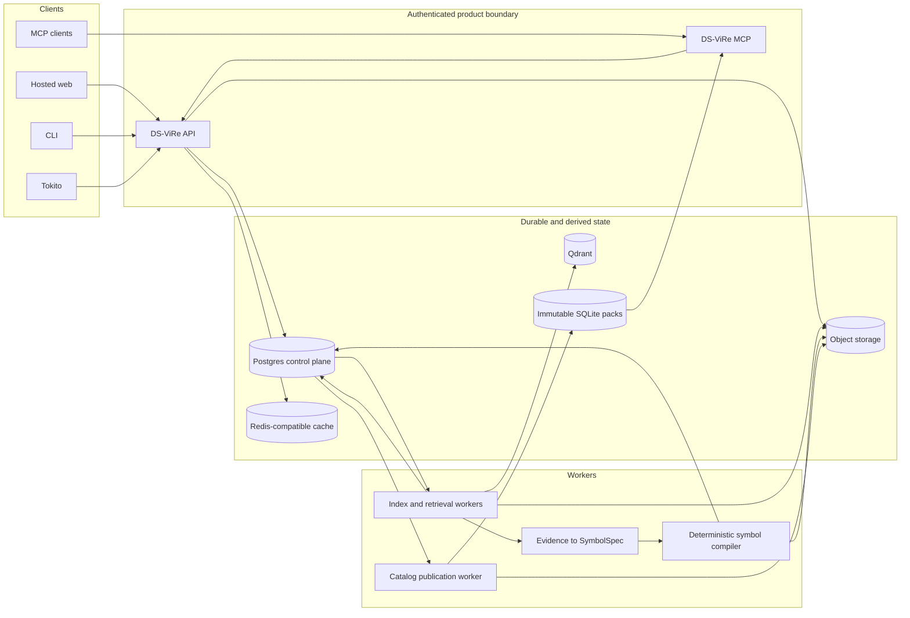
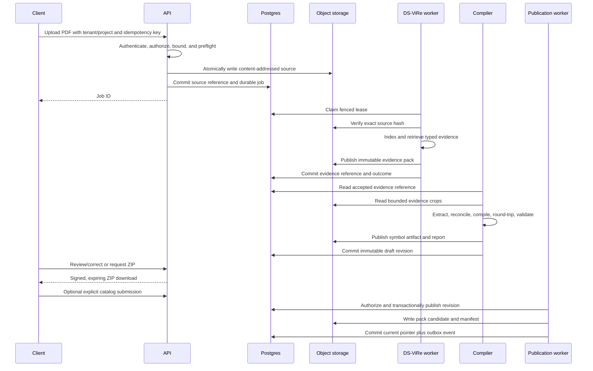

# Standalone service and catalog architecture

**Status:** partially implemented production architecture
**Updated:** 2026-08-18

This document defines the deployable product around DS-ViRe's retrieval core.
It separates trained models, durable workflow state, symbol publication, and
delivery so the same system can support Tokito, a hosted web application,
agent clients, the CLI, and self-hosted installations without private forks.

The central rule is:

> DS-ViRe produces verified evidence. Deterministic code produces symbol
> artifacts. An authenticated catalog control plane publishes revisions.

The target is not one foundation model or one shared database. It is a
versioned retrieval service backed by trained adapters and explicit stores.

---

## 1. Product surfaces

| Surface | Purpose | Authority |
|---|---|---|
| `dsvire` CLI | Local indexing, querying, validation, evaluation, export, and administration | User or service credential |
| HTTP API | Uploads, durable jobs, evidence queries, draft generation, validation, and downloads | Authenticated tenant/project scope |
| MCP | Bounded agent-facing evidence and generation tools | Read/query by default; publication is never implicit |
| Hosted web | Upload, progress, evidence review/correction, and ZIP download | Authenticated user scope |
| Tokito Cloud/Desktop | Per-design upload, realtime progress, resolve, place, save, and reopen | Existing Tokito identity and project/design scope |
| Self-hosted stack | Contract-equivalent local or organizational deployment | Deployment owner |

`dsvire.tokito.dev` is the hosted service boundary. Its DNS, TLS, Cloudflare
ingress, health, and readiness routes are live against the v0.6.3 production
data plane with separate API and worker processes. Its shipped authenticated HTTP
slice covers tenant authentication, durable upload/jobs, cancellation,
PostgreSQL-backed event replay with SSE fan-out, and verified bundle download.
The hosted web, dedicated MCP, symbol review/correction, and explicit catalog
contribution surfaces remain release work.

### 1.1 Current production implementation

The current single-host production profile uses PostgreSQL 18.4 for durable
job and event state, SeaweedFS for S3-compatible immutable objects, Qdrant for
derived retrieval state, and Valkey for disposable wake-up and event fan-out.
Tokito Cloud v0.10.4 owns generated-symbol revisions in PostgreSQL; MCP v0.1.8
consumes authenticated control-plane snapshots and promotes only a verified
immutable SQLite last-known-good pack. Production has no calibrated hybrid
retrieval pack installed, so that path remains fail-closed. A live API hostname
does not imply that the hosted browser review product is complete.

---

## 2. System topology



Services communicate through versioned authenticated APIs, durable records,
and publication events. DS-ViRe workers and MCP servers do not receive direct
catalog-writer credentials.

---

## 3. Data ownership

| System | Authoritative for | Explicitly not authoritative for |
|---|---|---|
| Postgres | Tenants, projects, jobs, leases, idempotency, document identity, part identity, immutable symbol revisions, validation, moderation, publication pointers, policy, audit, outbox | PDF/crop bytes, vectors, hot cache entries |
| Object storage | Source PDFs, rendered pages, crops, evidence packs, model artifacts, `.tokito_sym` files, reports, downloadable ZIPs | Mutable workflow state and permissions |
| Qdrant | Model- and pack-bound dense/multi-vector retrieval indexes | Original evidence, publication state, job truth |
| Redis-compatible cache | Rate limits, bounded hot results, cache-stampede locks, worker wake-ups, transient progress, SSE fan-out and limited replay | Jobs, permissions, revisions, evidence, audit, billing |
| SQLite catalog pack | Immutable published catalog snapshot for fast serving, rollback, offline use, and distribution | Authoring, moderation, mutable publication state |

Every derived store is rebuildable from Postgres plus immutable object
artifacts. Deleting every Redis key may reduce performance or shorten replay,
but must not lose work or change an authorization/publication decision.

### 3.1 Versioned cache keys

Cache identity includes every value that can change semantics:

```text
symbol:{catalog_version}:{symbol_revision_id}
search:{tenant_id}:{catalog_version}:{query_hash}
dsvire:{tenant_id}:{model_version}:{index_version}:{policy_version}:{query_hash}
job-progress:{tenant_id}:{job_id}
rate-limit:{tenant_id}:{principal_id}:{operation}
```

Cache values are bounded and TTL-controlled. Keys and telemetry never contain
raw PDF text, secrets, filenames, MPNs, user queries, or cross-tenant reusable
identifiers. Versioned keys are preferred to unsafe best-effort invalidation.

---

## 4. Durable upload and generation flow



Postgres owns the durable job state machine. A worker claims jobs with a fenced
lease and heartbeat. Redis may wake workers and carry progress, but recovery
scans Postgres, reconciles incomplete object writes, and resumes from atomic
checkpoints after process, cache, or host failure.

---

## 5. Symbol control plane

Official and generated symbols share a read contract, not mutable provenance.

Conceptually, the catalog records:

- normalized manufacturer/MPN/package part identities;
- stable catalog symbol identities;
- immutable symbol revisions with exact compiler/importer versions;
- canonical artifact hash and object reference;
- source kind, source revision, license, and evidence provenance;
- validation and moderation attempts;
- publication/supersession state and current-revision pointers;
- append-only security and operator audit events.

Official KiCad releases enter through a pinned importer. DS-ViRe submits
evidence-backed candidates through the same authenticated ingestion contract.
Neither source can bypass schema, parse-round-trip, geometry, identity,
provenance, and deterministic reproduction checks.

Publication uses a transactional outbox. A pack builder consumes committed
events, creates a complete digest-addressed SQLite candidate, verifies it, and
atomically promotes it. MCP hot-reloads only a complete verified pack and keeps
the last-known-good pack on failure. Corrections create new revisions; existing
revisions remain resolvable for designs that already embed them.

---

## 6. Evidence-to-download contract

A successful private generation does not automatically publish anything. The
user receives a preview and a deterministic downloadable bundle containing:

- canonical `.tokito_sym` and supported interchange artifacts;
- normalized part and package metadata;
- pin numbers, names, electrical types, units, and aliases;
- validation and parse-round-trip report;
- datasheet citation, exact page/bounding-box references, and content hashes;
- permitted evidence crops or private crop references;
- model, renderer, extractor, compiler, and policy versions;
- a machine-readable provenance manifest.

Public catalog contribution is a separate authenticated, authorized, and
audited action. A hosted deployment defaults all sources, evidence, drafts, and
indexes to private tenant scope.

---

## 7. API and MCP boundary

The exact paths are versioned contracts, but the capability groups are stable:

```text
upload datasheet       -> durable source + job
get/cancel job         -> authoritative state and bounded progress
search evidence        -> typed, source-linked regions
generate symbol draft  -> deterministic candidate revision
validate draft         -> structural/electrical/provenance report
download bundle        -> expiring private artifact
submit revision        -> explicit catalog workflow request
```

MCP exposes bounded equivalents such as `search_datasheet_evidence`,
`get_region`, `generate_symbol_draft`, `validate_symbol`, and
`download_component_bundle`. Public MCP calls do not turn model output into a
published catalog revision. Publication remains an authenticated catalog
control-plane operation with an explicit policy or review decision.

---

## 8. Deployment profiles

### 8.1 Hosted production

- separately deployable API/MCP, indexing, extraction/compiler, and catalog
  publication processes;
- managed or independently backed-up Postgres and S3-compatible storage;
- Qdrant collections scoped by tenant and exact model/index version;
- Redis-compatible cache configured with memory limits, eviction, TLS/auth,
  and no correctness-critical exclusive data;
- GPU workers scaled independently from CPU/API/catalog workers;
- private service network; only intended API/MCP/web edges are public.

### 8.2 Self-hosted

The supported Compose profile may colocate services on one host while
preserving the same network and authorization boundaries. Local filesystem
object storage and development pgvector are permitted only as explicit small
deployment profiles. Contract compatibility, deterministic artifacts, backup,
restore, and upgrade behavior remain required.

### 8.3 Offline

The CLI may build and query portable `.dsvire` packs and consume an immutable
SQLite catalog snapshot without cloud access. Offline mode does not silently
publish to the hosted catalog when connectivity returns.

---

## 9. Security, tenancy, and lifecycle invariants

1. Authenticate before buffering an upload; authorize every tenant/project/job
   and artifact read independently.
2. Validate PDFs in a bounded disposable worker with no ambient catalog or
   tenant credentials.
3. Use opaque normalized object keys and signed, short-lived downloads.
4. Encrypt durable stores and backups; verify content hashes on every worker
   boundary and restore.
5. Enforce per-tenant bytes, documents, jobs, concurrency, query, vector, and
   retained-artifact quotas transactionally.
6. Never include tenant, source, MPN, filename, query, or evidence content in
   unbounded metrics/cache labels.
7. Default source retention to deletion after terminal processing unless the
   tenant explicitly selects a supported retention policy.
8. Separate private generation from public contribution and publication.
9. Make cancellation, retries, lease loss, cache loss, partial object writes,
   and pack-build failure explicit test cases.
10. Pin model, renderer, schema, policy, compiler, catalog, and index identities
    in every output.

---

## 10. Migration from the current system

The target preserves working assets rather than replacing them in one cutover:

1. Keep the official `symbols.sqlite` and current published generated pack as
   immutable, reproducible serving artifacts.
2. Introduce the catalog Postgres schema and authenticated ingestion API.
3. Import current official and generated revisions with exact source/artifact
   hashes; compare a rebuilt pack byte-for-byte or semantically under a pinned
   migration policy.
4. Dual-build and read-compare immutable packs while existing MCP remains the
   serving authority.
5. Switch the writer authority only after migration, rollback, backup/restore,
   and last-known-good pack tests pass.
6. Add object storage, Qdrant, and Redis-compatible acceleration behind durable
   interfaces; prove rebuild/reconciliation and cache-loss behavior.
7. Expose standalone API/CLI/MCP/web surfaces after tenant isolation, quotas,
   retention, abuse controls, and end-to-end download gates pass.

No migration step authorizes automated generated-symbol publication. The
retrieval and evidence gates in the Technical Bible remain mandatory.

---

## 11. Completion gates

The standalone platform is complete only when:

1. A private user can upload a permitted PDF and safely resume the job after
   API, worker, cache, or host restart.
2. DS-ViRe returns model-bound, source-linked, calibrated evidence that passes
   the Technical Bible release gates.
3. The deterministic compiler produces a reproducible symbol or abstains with
   an actionable validation report.
4. The user can review/correct and download a complete deterministic bundle.
5. Optional contribution creates an immutable catalog revision only through
   the authenticated publication lifecycle.
6. MCP and Tokito resolve the exact published revision, and Tokito embeds its
   exact source in the design.
7. Redis loss, Qdrant rebuild, Postgres restore, object-store recovery, pack
   rollback, and model/index migration are tested.
8. Hosted and self-hosted contracts are documented, versioned, observable,
   bounded, and reproducible.
