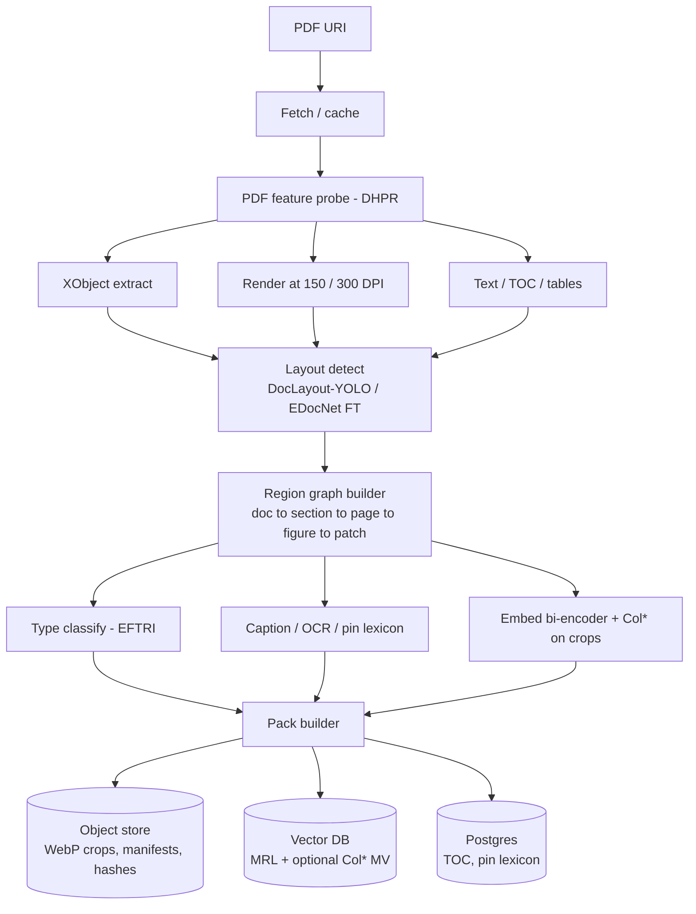
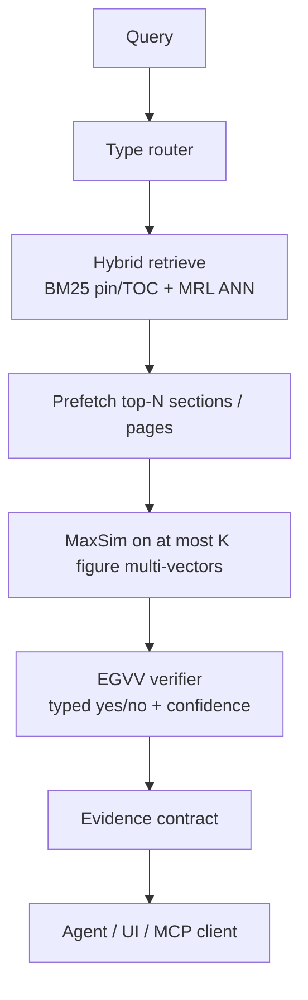
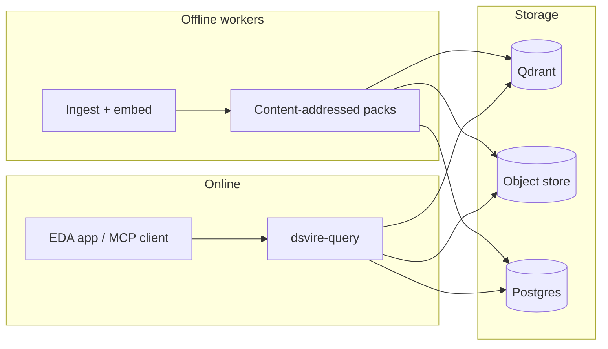
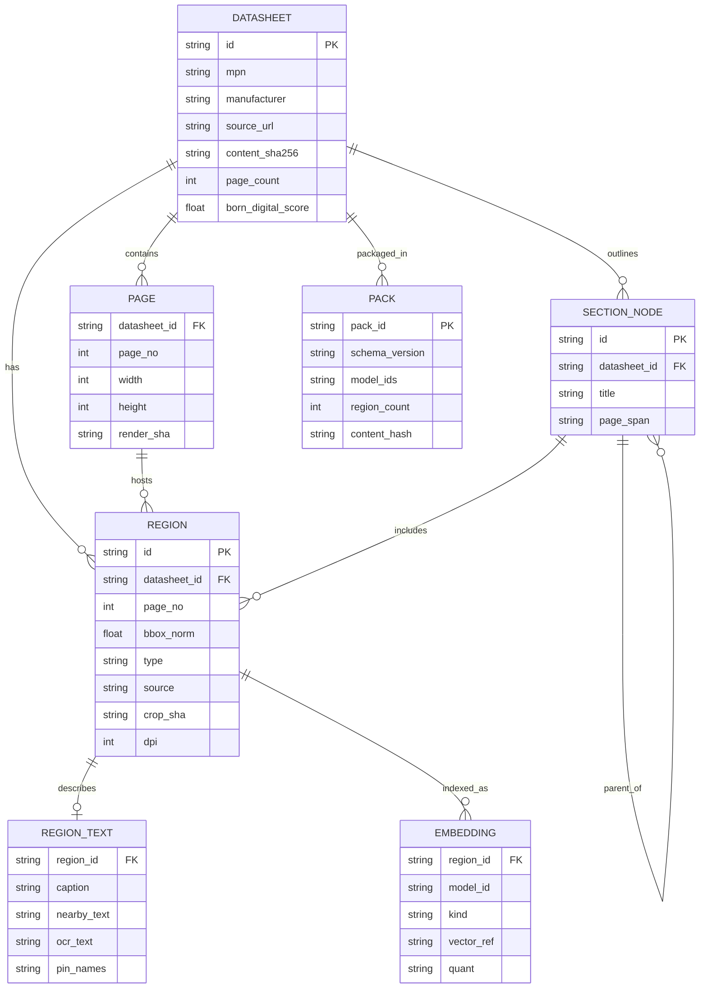
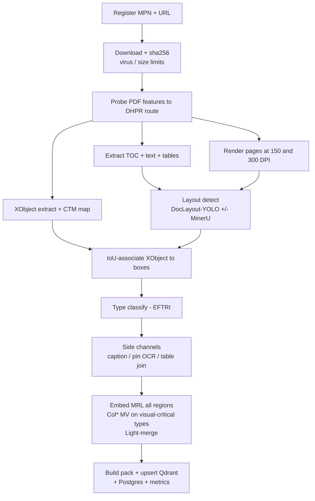
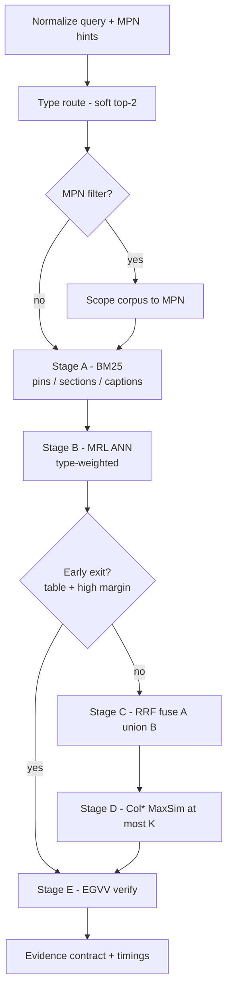

# DS-ViRe technical bible

**Status:** canonical architecture plus implemented deterministic baseline; calibrated EGVV and the full benchmark remain in progress
**Updated:** 2026-08-12
**DS-ViRe:** Datasheet Visual Retrieval

Canonical public specification for figure-level, vision-first retrieval over semiconductor datasheets.

---

## 0. Summary

| Question | Answer |
|---|---|
| Is OCR-free visual document retrieval real? | Yes. ColPali, ColQwen, DSE, VisRAG, ViDoRe (2024-2026). |
| Is "run ColPali on PDFs" the contribution? | No. That is baseline engineering. |
| What is this project? | **Figure/region-level** retrieval for **electronics datasheets**, with an EDA figure ontology, layout-gated cascade, pin/electrical consistency, and an open benchmark. |
| Buildable today? | Yes: layout detect + crop ColQwen + hybrid text gate + Qdrant MaxSim. |
| Deployment shape | Heavy indexing offline. Clients query thin packs or a query API. |

---

## 1. Problem

### 1.1 What users need

When an engineer or agent looks up a part, the answer is often visual:

- pin / ball map
- package outline / land pattern
- timing diagram
- characteristic / SOA curve
- typical application circuit
- block diagram

Datasheets run 50 to 2000+ pages. OCR chunk RAG loses drawings. Dumping whole PDFs into a VLM is slow and brittle.

### 1.2 Task

**Corpus.** Datasheet PDFs with pages, detected regions (figures/tables), and optional side channels (TOC, pin tables, captions).

**Query.** Natural language or typed intent: `pinout | package | timing | curve | app_circuit | table | other`.

**Result.** Ranked evidence:

```text
Evidence = {
  mpn, datasheet_id, page,
  region_bbox, region_type,
  crop_uri, caption?, pin_lexicon?,
  score, provenance
}
```

Success means top-k contains the region a competent EE would use, scored at page / figure / bbox / pin-row levels, not "a vaguely related page."

### 1.3 Non-goals

| Non-goal | Why |
|---|---|
| Replace CAD symbol/footprint libraries | Different layer; retrieval cites and verifies against figures |
| Schematic image to netlist | Orthogonal (SINA, OmniSch, etc.) |
| Generate symbol geometry inside DS-ViRe | A downstream Tokito-native compiler consumes DS-ViRe evidence; retrieval remains independently benchmarkable |
| Train a frontier VLM from scratch | Fine-tune or call open Col* / layout models |
| Claim 100% of every PDF | Measure coverage and document failure modes |

---

## 2. Related work

### 2.1 Vision-first document retrieval

| Work | Venue / ID | Role |
|---|---|---|
| ColBERT | SIGIR 2020 · [2004.12832](https://arxiv.org/abs/2004.12832) | Late interaction / MaxSim |
| ColPali | ICLR 2025 · [2407.01449](https://arxiv.org/abs/2407.01449) | Page-as-image multi-vector VDR; ViDoRe |
| DSE | EMNLP 2024 · [2406.11251](https://arxiv.org/abs/2406.11251) | Single-vector screenshot baseline |
| VisRAG | [2410.10594](https://arxiv.org/abs/2410.10594) | Visual retrieve then generate |
| M3DocRAG | [2411.04952](https://arxiv.org/abs/2411.04952) | Multi-doc ColPali + VLM QA |
| ViDoRe V2 | [2505.17166](https://arxiv.org/abs/2505.17166) | Harder multilingual VDR |
| ViDoRe V3 | ACL 2026 · [2601.08620](https://arxiv.org/abs/2601.08620) | Retrieval + bbox grounding |
| Light-ColPali / ColQwen2 | [2506.04997](https://arxiv.org/abs/2506.04997) | Token merging (~98% quality @ ~12% memory) |
| HPC-ColPali | [2506.21601](https://arxiv.org/abs/2506.21601) | Hierarchical patch compression |
| Visual RAG Toolkit | [2602.12510](https://arxiv.org/html/2602.12510) | Pooling + multi-stage search |
| Snappy | [2512.02660](https://arxiv.org/abs/2512.02660) | Patch to OCR-region bridge |
| PLAID | [2205.09707](https://arxiv.org/abs/2205.09707) | Efficient late-interaction engine |
| ColBERTv2 | [2112.01488](https://arxiv.org/abs/2112.01488) | Residual compression |
| MUVERA | NeurIPS 2024 · [2405.19504](https://arxiv.org/abs/2405.19504) | Fixed-dimensional multi-vector ANN |
| MRL | NeurIPS 2022 · [2205.13147](https://arxiv.org/abs/2205.13147) | Nested embedding dims |
| ColQwen2 | HF `vidore/colqwen2*` | Production backbone candidates |

### 2.2 Layout and parsing

| Work | ID | Role |
|---|---|---|
| DocLayout-YOLO | [2410.12628](https://arxiv.org/abs/2410.12628) | Real-time layout / figure boxes |
| MinerU | [2409.18839](https://arxiv.org/abs/2409.18839) | PDF structure fallback |
| DiagramBank | [2604.20857](https://arxiv.org/html/2604.20857v2) | Scientific diagram retrieval patterns |
| ACL-Fig | CEUR | Figure-type classification precedent |

### 2.3 Electronics document AI (mostly extraction, not IR)

| Work | ID | Gap |
|---|---|---|
| DocEDA | [2412.05301](https://arxiv.org/abs/2412.05301) | Extraction / design, not corpus figure IR |
| EDocNet | [2502.16541](https://arxiv.org/abs/2502.16541) | Datasheet layout taxonomy (reuse classes) |
| SFgen / SFnet | [2607.19767](https://arxiv.org/abs/2607.19767) | Symbol/footprint gen; assumes right figures |
| D2S-FLOW | [2502.16540](https://arxiv.org/abs/2502.16540) | Text param to SPICE RAG |
| OmniSch / SINA | [2604.00270](https://arxiv.org/abs/2604.00270), [2601.22114](https://arxiv.org/abs/2601.22114) | Schematic understanding, not datasheet figure IR |

Industry text extractors and CAD libraries get you to a PDF or a symbol file. They do not publish an open figure-grounded datasheet retrieval benchmark.

Runnable, source-free examples of the implemented evidence contract and current
development comparators live in the source-free `evaluation/results/` records. Generated visuals
derive from committed JSON and must not be treated as held-out accuracy proof.

---

## 3. Design contributions

1. **DS-ViRe benchmark** - open figure-level IR bench (page / figure / bbox / pin-row; typed queries; hard negatives; robustness suite).
2. **Layout-Gated Patch Cascade (LGPC)** - layout as a *compute gate* for Col* on crops (layout helps when it is domain signal).
3. **EDA Figure-Type Routed Indexes (EFTRI)** - type-conditioned indexes (`pinout`, `package`, `timing`, ...).
4. **Caption-Pin-Patch Triple Index (CPPT)** - pin lexicon as a first-class modality.
5. **Electrical consistency metrics** - citation IoU and pin/CAD agreement, not only nDCG.
6. **Offline/online split** - workers build packs; clients run thin query paths.
7. **Dual-source figures (DSFF)** - PDF XObject plus high-DPI render, associated by geometry.
8. **Evidence-gated verify (EGVV)** - small VLM abstain before agent context.
9. **Parser meta-router (DHPR)** - born-digital vs scan vs image-heavy routing.

---

## 4. Architecture

### 4.1 Offline index



### 4.2 Online query



### 4.3 Placement



### 4.4 Principles

1. Figures are the atomic index unit; pages are parents; patches are optional.
2. Text is a gate and a pin modality, not the sole truth for drawings.
3. Cascade everything; never MaxSim the full index on every query.
4. Provenance is mandatory: `{page, bbox, type, hash}`.
5. Fail closed for agents: low confidence abstains.
6. Packs are content-addressed and versioned with model IDs.
7. Interactive clients must not block on GPU indexing.

### 4.5 Components

| Component | Home | Role |
|---|---|---|
| `dsvire-index` | this repo | Ingest, layout, embed, pack build |
| `dsvire-query` | this repo | Cascade + verify API |
| Vector store | Qdrant (prod) / pgvector (dev) | Multi-vector + payloads |
| Object store | S3-compatible or local | Crops and packs |
| MCP tools | this repo (planned) | Agent-facing search |

Packages (planned): `core`, `index`, `query`, `bench`, `pack`.

### 4.6 Tokito symbol product integration

DS-ViRe is the evidence boundary for Tokito's datasheet-to-symbol product. It
does not ask an LLM to emit symbol files or geometry. The downstream compiler
consumes versioned evidence and deterministically constructs Tokito's canonical
symbol model.

```text
datasheet upload
  -> DS-ViRe index and retrieve
  -> pinout + pin-table + package evidence bundle
  -> constrained SymbolSpec extraction and reconciliation
  -> deterministic Tokito symbol compiler
  -> native .tokito_sym artifact
  -> authenticated catalog ingestion
  -> tokito-mcp unified read surface
  -> Tokito Desktop placement and schematic embedding
```

The product must preserve three distinct identities:

- `part_id`: manufacturer + exact MPN + package identity for BOM/procurement.
- `library_id` / `symbol_id`: catalog geometry identity used for resolution.
- embedded `.tokito_sym`: immutable schematic-local definition used for stable
  rendering and netlists.

The catalog's current immutable upstream pack and the future generated-symbol
store must resolve through one catalog contract. Runtime MCP reads must not
silently become an unauthenticated write path. See
[`TOKITO_SYMBOL_PIPELINE.md`](TOKITO_SYMBOL_PIPELINE.md) for the product
contract, generation rules, publication lifecycle, and ecosystem boundaries.

---

## 5. Tech stack

### 5.1 Services

| Layer | Choice | Why |
|---|---|---|
| Index / ML workers | Python 3.11+ | ColPali-engine, DocLayout-YOLO, PDFium/pypdf |
| Query API | Rust (Axum) or FastAPI | Thin wrapper over vector DB |
| Pack format | `.dsvire` (tar+zstd) + JSON manifest | Portable offline packs |
| Vector DB | Qdrant | Multi-vector MaxSim, binary quant |
| Metadata | Postgres | Jobs, MPN registry, eval labels |
| Queue | NATS or Redis streams | Index jobs |
| Observability | OpenTelemetry + Prometheus | SLOs |

### 5.2 Models

| Role | Primary | Fallback |
|---|---|---|
| Layout | DocLayout-YOLO | MinerU layout |
| Type head | Fine-tune on EDocNet / DS-ViRe labels | Zero-shot VLM |
| Cheap dense | SigLIP / MRL bi-encoder on crop+caption | CLIP |
| Late interaction | ColQwen2-2B (`vidore/colqwen2-v1.0`) | ColQwen2.5; ColSmol for edge |
| Compression | Light-ColPali merge + Qdrant binary + rescore | MUVERA FDE stage |
| Captions | Constrained VLM schema | Skip if budget tight |
| Verifier | Small VLM structured JSON | Caption cross-encoder |

Pin model SHAs and DPI in every pack `manifest.json`. Eval refuses mismatched embeds.

### 5.3 PDF / vision

Pinned PDFium is the sole production/evaluation renderer and text-geometry
backend. Strict pypdf preflight rejects password-gated and structurally repaired
inputs before evidence publication; readable permission-encrypted vendor PDFs
are accepted with the empty standard user password. Every crop and text query
is bounded, resources are explicitly closed, and backend/version changes
invalidate caches, adapters, and renderer-bound benchmark evidence. Pillow/OpenCV,
pin OCR (PaddleOCR/Surya) on pinout crops only, and `colpali-engine` provide the
remaining vision path.

### 5.4 Hardware profiles

| Profile | Hardware | Use |
|---|---|---|
| `index.gpu.standard` | 24GB class GPU | Crop ColQwen2-2B batch index |
| `query.server` | 16GB+ GPU or CPU+quant | Online MaxSim top-K |
| `desktop.thin` | No GPU required | Pack + BM25/MRL; optional remote MaxSim |

---

## 6. Data model



Region `type`: `pinout | package | timing | curve | block | app_circuit | table | other`.  
Region `source`: `xobject | render | ensemble`.  
Embedding `kind`: `mrl64 | mrl512 | col_mv | fde`.

### Evidence contract (API / MCP)

```json
{
  "query_id": "...",
  "results": [
    {
      "rank": 1,
      "score": 0.83,
      "mpn": "STM32H743VIT6",
      "datasheet_id": "st-ds-...",
      "page": 42,
      "bbox_norm": [0.08, 0.12, 0.92, 0.71],
      "type": "pinout",
      "crop_url": "dsvire://pack/.../r_0182.webp",
      "caption": "Figure 7. LQFP100 pinout",
      "pin_hits": ["VDD", "NRST"],
      "section_path": ["Pinouts and pin description", "LQFP100"],
      "verification": {
        "method": "evidence_gated_visual",
        "policy_version": "egvv@<model-and-calibration-version>",
        "outcome": "accepted",
        "score": 0.91,
        "score_semantics": "calibrated_probability"
      },
      "content_hash": "sha256:..."
    }
  ],
  "abstained": false,
  "timings_ms": {"route": 3, "ann": 12, "maxsim": 48, "verify": 90}
}
```

Only `verification.outcome=accepted` from a method explicitly allowed by the
consumer's publication policy may enter agent context. Heuristic evidence and
calibrated EGVV are distinct policy classes.

---

## 7. Pipelines

### 7.1 Ingest



Idempotency: same `content_sha256` + `model_id` skips. Model bump rebuilds embeddings only.

### 7.2 Query



### 7.3 Robustness

Index-time views for critical types: DPI {150, 300}, grayscale, mild JPEG, synthetic watermark band. Query score = max over views. Eval splits: born-digital vs scan vs watermarked.

### 7.4 Failures

| Failure | Behavior |
|---|---|
| Layout miss on pin page | TOC keyword backfill forces page-level region |
| No text layer | Disable BM25 gate; visual stages only |
| Verifier abstain | `abstained=true`; show candidates separately |
| Pack/model mismatch | Hard error |
| Encrypted PDF | Reject with actionable error |

---

## 8. SLOs (v1 targets)

| SLO | Target | Notes |
|---|---|---|
| Query p95 (hot pack, server MaxSim) | <= 800 ms | Excluding cold download |
| Query p95 (thin client + remote MaxSim) | <= 1.5 s | Network included |
| Figure R@5 on DS-ViRe test | >= full-page ColQwen2 - 1 pt and >= text-RAG + 15 pts | Primary quality gate |
| Index throughput | >= 2 pages/s/GPU (crop path) | Batch tuning |
| Pack size | <= 15% of naive full-page ColQwen index | Light-merge + crop gate |
| Agent wrong-figure rate | <= 2% on verified path | EGVV |
| Query API availability | 99.5% | Standard |

No production release tag if DS-ViRe regresses more than 2 nDCG points or p95 misses SLO without an explicit waiver.

---

## 9. Benchmark: DS-ViRe

### 9.1 Corpus

- v1 acquisition registry: 635 verified manufacturer datasheets / 25,324 pages,
  stratified across 10 coarse categories and 23 manufacturers. Public manifests,
  digests, weak-label tiers, and limitations live under `datasets/corpus-v1/`.
- Mix born-digital and scanned.
- **Do not redistribute PDFs.** Ship URLs, SHA256, page counts, annotation JSON, download script.

The baseline release gate also runs the source-generated manifest at
`fixtures/robustness/v1/manifest.json`. Its recipes create synthetic PDFs at
test time rather than committing opaque or copyrighted document bytes. Each
case binds the production outcome, evidence-pack publication/cleanup behavior,
and a strict `pypdf` structural observation. This covers deterministic controls
for rotation, scan-only abstention, encryption, truncation/partial transfer,
byte/page/render bounds, duplicate idempotency, and changed revisions. It is a
regression corpus, not a substitute for mutation fuzzing or the representative
retrieval benchmark.

### 9.2 Annotations

```text
(query_id, query_text, query_type, mpn?,
 relevant: [{datasheet_sha, page, region_id?, bbox?, grade: 0|1|2}],
 hard_negatives: [...])
```

Query families: pin/ball map, package/land pattern, timing/SOA/Bode, app circuit, electrical table, multi-hop (table + figure).

Hard negatives: same MPN wrong type; near-miss packages; top vs bottom view; lookalike families.

### 9.3 Metrics

nDCG@5 / R@5 (page, figure), mAP, bbox IoU Hit, pin-row Hit@1, type accuracy, Delta R@5 under corruption, p95 latency, MB/region, electrical consistency, optional agent task success at fixed context budget.

### 9.4 Required baselines

BM25 on structured text; dense text RAG; SigLIP/CLIP pages; DSE-style page vector; ColQwen2 full page; ColQwen2 + Light-merge; layout-crop + SigLIP; **LGPC** / **LGPC+EFTRI**.

### 9.5 Licenses

Annotations: CC BY 4.0. Code: Apache-2.0. Model weights: upstream terms in NOTICE. Datasheets: user-downloaded; hashes only in the release.

---

## 10. Repository layout

```text
tokito-dsvire/
  README.md
  LICENSE
  NOTICE
  CITATION.cff
  CONTRIBUTING.md
  docs/TECHNICAL_BIBLE.md
  docs/TOKITO_SYMBOL_PIPELINE.md
  datasets/         # training manifests, source review, labels, annotations
  packages/          # upcoming
  configs/
  scripts/
  packs/             # gitignored
```

Release train (code):

| Tag | Contents |
|---|---|
| `v0.1.0-bench` | Annotations + download scripts + baseline runners |
| `v0.2.0-index` | LGPC ingest + pack format |
| `v0.3.0-query` | Query API + MCP tools |
| `v1.0.0` | SLO-compliant + reproduce scripts |

---

## 11. Security and legal

| Topic | Policy |
|---|---|
| Datasheet copyright | Private caches only; no public PDF corpora |
| Pack sharing | Crops may still be copyrighted; default private packs; public demos use permitted samples |
| User PDFs | Local or opt-in cloud processing |
| OCR / captions | Untrusted input; schema-constrained tools |
| Model licenses | Track in NOTICE |

### 11.1 Hosted baseline enforcement

The private hosted baseline fails startup unless a service bearer of at least
32 bytes is configured. Unauthenticated execution is restricted to an explicit
development/test mode and must bind to loopback. Authentication occurs before
the request body is buffered.

PDF parsing and rendering run in a disposable spawned process rather than the
API process. The API applies bounded admission, a wall-clock deadline, and
termination on timeout or cancellation. Linux workers additionally receive
CPU, address-space, output-file, descriptor, and core-dump resource limits.
Persistent evidence packs use an exact-input/identity/version cache key, keyed
file locking, integrity checks, staging directories, and atomic publication.
Before publishing a pack, the deterministic baseline independently requires
the manufacturer in bounded PDF text and a token-bounded exact MPN in the same
logical orderable-part row as the requested package. Bounded wrapped row
continuations are allowed; adjacent part rows are not. That association is
emitted as its own package crop. Near-miss part numbers and packages mentioned
elsewhere in a multi-variant datasheet cause abstention.

These controls are a parser containment baseline, not a claim that arbitrary
PDFs are safe or that text grounding is calibrated EGVV. Production deployment
must also enforce container CPU, memory, PID, filesystem, and network policy
and maintain a parser vulnerability-update process. See
[`STATUS.md`](STATUS.md).

---

## 12. Roadmap (public)

### Near term

- [x] Corpus download + SHA registry (635 PDFs; bytes private, manifests public)
- [ ] Layout to crop pipeline + pack schema v0
- [ ] SigLIP + BM25 end-to-end smoke path
- [ ] Annotation schema + first gold query set
- [ ] ColQwen2 crop index + Qdrant MaxSim
- [ ] LGPC vs full-page Col* baselines on DS-ViRe v0.1
- [ ] Query API + MCP tools
- [ ] Versioned Tokito symbol evidence-bundle contract
- [ ] End-to-end generated-symbol vertical slice through the Tokito catalog
- [ ] SLO dashboards

### Later

- EFTRI type router, Light-merge + binary quant Pareto, EGVV, robustness suite
- Larger corpus, offline pack sync for desktop clients
- Optional schematic-to-datasheet cross-modal retrieval
- Pin-locus subset and public leaderboard

---

## 13. Engineering rules

1. Claims that ship in eval tables have a reproduce script.
2. Features behind flags still hit CI smoke tests.
3. Pin model/dataset/pack SHAs for reported numbers.
4. Ablate LGPC vs full-page vs text; no anecdote-only launches.
5. Keep a failure catalog: scanned, vector-only, multi-panel, encrypted.
6. Benchmark artifacts before marketing pages.
7. Client latency is a first-class metric.
8. Agents get evidence contracts, not raw PDF dumps.
9. Generated pins retain exact datasheet page, region, bbox, and content-hash provenance.
10. No model directly publishes symbol geometry or catalog records; deterministic compilers and publication gates own those transitions.

---

## 14. Risks

| Risk | Likelihood | Impact | Mitigation |
|---|---|---|---|
| Layout misses pin art | Med | High | TOC backfill + page fallback |
| Col* storage blowup | High | High | Crops-only + Light-merge + quant |
| Type classifier domain shift | Med | Med | Labels + hard negatives |
| Copyright limits demos | Med | Med | Hash-only corpus; private packs |
| No local GPU on client | High | Med | Thin pack + remote MaxSim |
| Scope creep into CAD generation | High | High | Non-goals in review |
| Bench too small | Med | High | 500 PDFs / 2k queries before v1 claims |

---

## 15. Glossary

| Term | Meaning |
|---|---|
| DS-ViRe | Datasheet Visual Retrieval (bench + system) |
| LGPC | Layout-Gated Patch Cascade |
| EFTRI | EDA Figure-Type Routed Indexes |
| CPPT | Caption-Pin-Patch Triple index |
| EGVV | Evidence-Gated Visual Verify |
| DSFF | Dual-Source Figure Fusion |
| MaxSim | ColBERT late-interaction score |
| Pack | Content-addressed offline index artifact |

---

## 16. Document control

| Version | Date | Notes |
|---|---|---|
| 0.1 | 2026-08-03 | Initial architecture from research synthesis |
| 0.2 | 2026-08-03 | Public cleanup; Mermaid node ID fixes; internal product plans removed |
| 0.3 | 2026-08-08 | Tokito symbol product integration (§4.6); provenance/publication rules (§13.9–10); roadmap items for evidence-bundle contract and end-to-end generated-symbol slice; sample JSON `bbox_norm` naming |
| 0.4 | 2026-08-11 | Fail-closed hosted authentication, bounded admission, isolated PDF workers, resource limits, and atomic evidence-pack publication (§11.1) |
| 0.5 | 2026-08-12 | Corrected implementation status and linked deterministic public evidence/benchmark examples; no architecture or SLO change |
| 0.6 | 2026-08-17 | Bound the 635-document corpus-v1 acquisition registry, public metadata layout, and private-byte rights boundary (§9.1, §10, §12) |

Update this file in the same PR as architecture or SLO changes.
