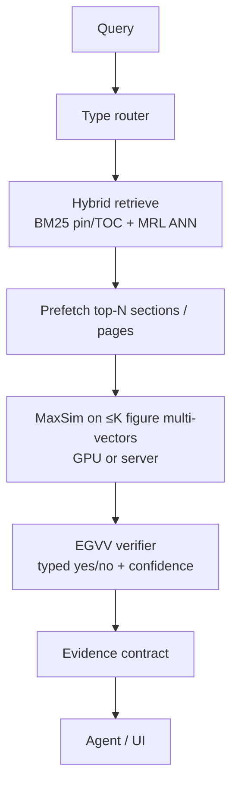
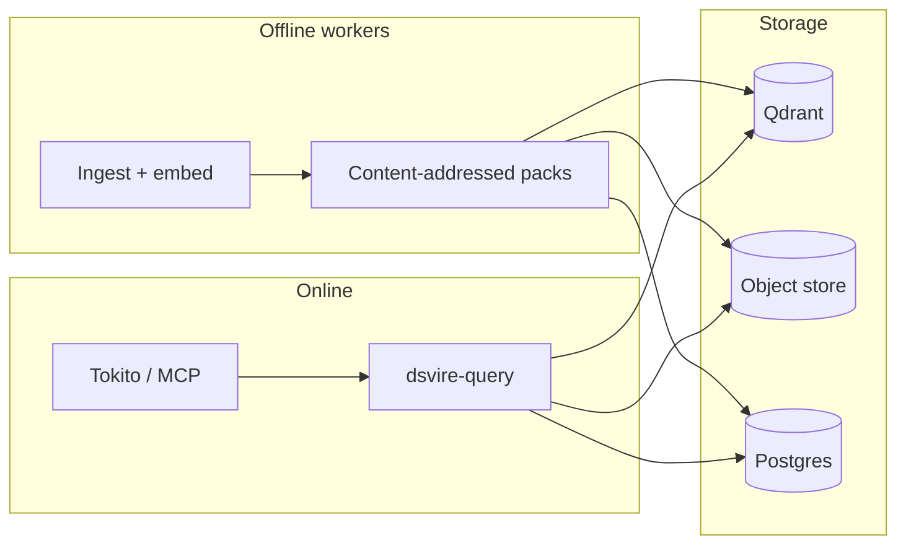
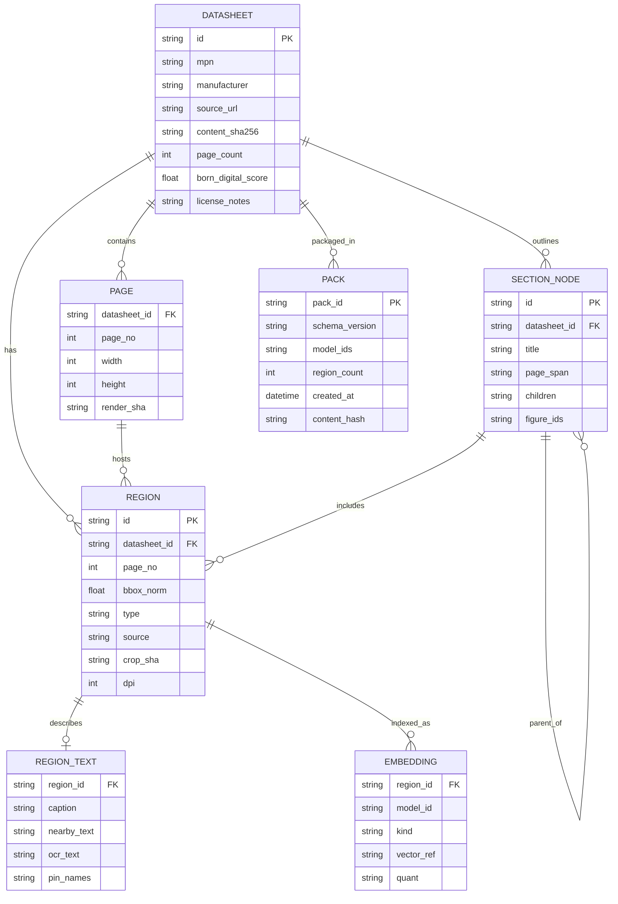
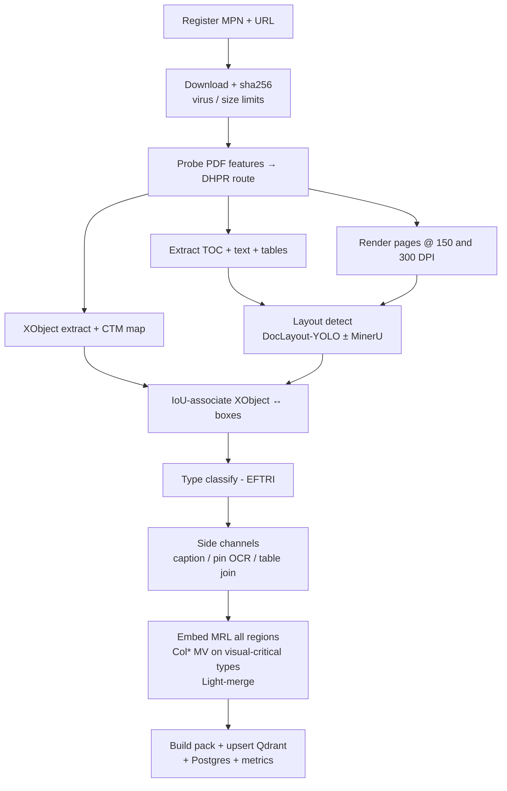
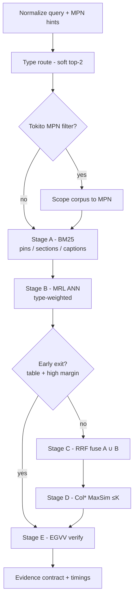

# Datasheet Visual Retrieval (DS-ViRe) — Technical Bible

**Status:** R&D → production specification (not an MVP sketch)  
**Owner intent:** publishable research + open-source system + production service for Tokito / VtronTokito  
**Last updated:** 2026-08-03  
**Codename:** DS-ViRe (*Datasheet Visual Retrieval*)

This document is the single source of truth for the vision-first electronics datasheet retrieval program: problem, related work, architecture, stack, SLOs, benchmark, paper portfolio, open-source release, and production roadmap. It deliberately separates **what is already buildable with existing models** from **what is novel and publishable**.

---

## 0. One-page verdict

| Question | Answer |
|---|---|
| Is OCR-free visual document retrieval real? | Yes. ColPali / ColQwen / DSE / VisRAG / ViDoRe established it (2024–2026). |
| Is “run ColPali on PDFs” novel? | No. That is engineering. |
| What is novel here? | **Figure/region-level** retrieval over **semiconductor datasheets**, with **EDA figure ontology**, **layout-gated cascade**, **pin/electrical consistency**, and an **open benchmark**. |
| Is it buildable with today’s stack? | Yes. Layout detect + crop ColQwen + hybrid text gate + Qdrant MaxSim. |
| Production constraint? | Heavy indexing is **offline** (Companion / cloud workers). Desktop runs a **thin query pack**, not full Col* on every PDF open. |
| First shippable paper? | Benchmark (DS-ViRe) + Layout-Gated Patch Cascade + baselines. |
| Wikipedia / notability? | Not a deliverable. Earn secondary coverage via open benchmark adoption, citations, and real EDA use — then encyclopedia pages become possible. |

**Positioning sentence (papers + README):**

> Existing electronics RAG systems retrieve text or whole PDFs; schematic vision systems recover netlists. DS-ViRe introduces figure-level visual retrieval over semiconductor datasheets with region grounding, type-routed indexes, and electrical consistency checks — and shows large gains on pinout and land-pattern queries where text RAG and ungrounded VLMs fail.

---

## 1. Problem statement

### 1.1 User problem (Tokito / EDA)

When an engineer or AI agent needs information from a component datasheet, the answer is often **visual**:

- pin / ball map
- package outline / land pattern
- timing diagram
- characteristic / SOA curve
- typical application circuit
- block diagram

Datasheets are 50–2000+ pages. Traditional text RAG (OCR → chunk → embed) loses layout and fails on drawings. Dumping hundreds of pages into a VLM is slow, expensive, and unstable.

### 1.2 Formal IR task

**Corpus.** Set of datasheet PDFs \(\{D_i\}\), each with pages \(p\), detected regions \(r\) (figures/tables), optional structured side-channels (TOC, pin tables, captions).

**Query.** Natural-language or structured engineer intent \(q\) (optionally typed: `pinout | package | timing | curve | app_circuit | table | other`).

**Retrieve.** Ranked list of evidence units:

```text
Evidence = {
  mpn, datasheet_id, page,
  region_bbox, region_type,
  crop_uri, caption?, pin_lexicon?,
  score, provenance
}
```

**Succeed when.** Top‑k evidence contains the region a competent EE would use to answer \(q\), measured at page / figure / bbox / pin-row granularities — not merely “some related page.”

### 1.3 Non-goals (explicit)

| Non-goal | Why |
|---|---|
| Replace SnapEDA / Ultra Librarian CAD libraries | Different product; we *cite and verify* CAD against figures |
| Schematic image → netlist (SINA / OmniSch lane) | Orthogonal; we may *consume* those as query modality later |
| Datasheet → symbol/footprint generation (SFgen lane) | Downstream consumer of our retrieval |
| Train a frontier VLM from scratch | Use / fine-tune open Col\* / layout models |
| Claim 100% “any PDF” | Claim measured coverage + failure taxonomy |

---

## 2. Related work (cite this)

### 2.1 Vision-first document retrieval

| Work | Venue / ID | Role for us |
|---|---|---|
| **ColBERT** (Khattab & Zaharia) | SIGIR 2020 · [arXiv:2004.12832](https://arxiv.org/abs/2004.12832) | Late interaction / MaxSim primitive |
| **ColPali** (Faysse et al.) | ICLR 2025 · [arXiv:2407.01449](https://arxiv.org/abs/2407.01449) | Page-as-image multi-vector VDR; ViDoRe |
| **DSE** (Ma et al.) | EMNLP 2024 · [arXiv:2406.11251](https://arxiv.org/abs/2406.11251) | Single-vector screenshot bi-encoder baseline |
| **VisRAG** (Yu et al.) | [arXiv:2410.10594](https://arxiv.org/abs/2410.10594) | Visual retrieve → visual generate loop |
| **M3DocRAG** (Cho et al.) | [arXiv:2411.04952](https://arxiv.org/abs/2411.04952) | Multi-doc ColPali + VLM QA |
| **ViDoRe V2** | [arXiv:2505.17166](https://arxiv.org/abs/2505.17166) | Harder multilingual VDR bench |
| **ViDoRe V3** | ACL 2026 · [arXiv:2601.08620](https://arxiv.org/abs/2601.08620) | Retrieval + bbox grounding + answers |
| **Light-ColPali / ColQwen2** | [arXiv:2506.04997](https://arxiv.org/abs/2506.04997) | Token merging; ~98% quality @ ~12% memory |
| **HPC-ColPali** | [arXiv:2506.21601](https://arxiv.org/abs/2506.21601) | Hierarchical patch compression |
| **Visual RAG Toolkit** | [arXiv:2602.12510](https://arxiv.org/html/2602.12510) | Training-free pooling + multi-stage search |
| **Snappy** (patch→region) | [arXiv:2512.02660](https://arxiv.org/abs/2512.02660) | Closest region bridge; OCR-box dependent |
| **Nemotron ColEmbed V2** | [arXiv:2602.03992](https://arxiv.org/abs/2602.03992) | Industrial Col\* scaling recipe |
| ColQwen2 models | HF `vidore/colqwen2*` | Production backbone candidates |
| **PLAID** | [arXiv:2205.09707](https://arxiv.org/abs/2205.09707) | Efficient late-interaction engine |
| **ColBERTv2** | [arXiv:2112.01488](https://arxiv.org/abs/2112.01488) | Residual compression |
| **MUVERA** | NeurIPS 2024 · [arXiv:2405.19504](https://arxiv.org/abs/2405.19504) | Fixed dimensional encoding for multi-vector ANN |
| **MRL** (Matryoshka) | NeurIPS 2022 · [arXiv:2205.13147](https://arxiv.org/abs/2205.13147) | Nested dimensions for cheap→expensive funnel |

### 2.2 Layout / document parsing

| Work | ID | Role |
|---|---|---|
| **DocLayout-YOLO** | [arXiv:2410.12628](https://arxiv.org/abs/2410.12628) | Real-time layout / figure boxes |
| **MinerU** | [arXiv:2409.18839](https://arxiv.org/abs/2409.18839) | PDF→structure fallback |
| LayoutLM / v2 / v3 | 1912.13318 / 2012.14740 / 2204.08387 | Historical layout DocAI |
| DocVQA / ChartQA / InfographicVQA | 2007.00398 / 2203.10244 / 2104.12756 | Capability probes, not our IR bench |
| **DiagramBank** | [arXiv:2604.20857](https://arxiv.org/html/2604.20857v2) | Scientific diagram retrieval dataset patterns |
| **ACL-Fig** | CEUR · figure classification | Figure-type labeling precedent |

### 2.3 Electronics / EDA document AI (orthogonal — cite as domain gap)

| Work | ID | Gap vs DS-ViRe |
|---|---|---|
| **DocEDA** | [arXiv:2412.05301](https://arxiv.org/abs/2412.05301) | Extraction / design; not corpus figure IR |
| **EDocNet** | [arXiv:2502.16541](https://arxiv.org/abs/2502.16541) | Datasheet layout taxonomy (reuse classes) |
| **SFgen / SFnet** | [arXiv:2607.19767](https://arxiv.org/abs/2607.19767) | Symbol/footprint gen; assumes right figures |
| **D2S-FLOW** | [arXiv:2502.16540](https://arxiv.org/abs/2502.16540) | Text param→SPICE RAG |
| **MuaLLM** | [arXiv:2508.08137](https://arxiv.org/abs/2508.08137) | Circuit *paper* RAG, not datasheets |
| **SINA** | [arXiv:2601.22114](https://arxiv.org/abs/2601.22114) | Schematic→netlist |
| **OmniSch** | [arXiv:2604.00270](https://arxiv.org/abs/2604.00270) | Schematic LMM benchmark |
| **AnalogRetriever** | [arXiv:2604.23195](https://arxiv.org/abs/2604.23195) | Circuit modalities; not MPN datasheet figures |
| **CircuitSense** | [arXiv:2509.22339](https://arxiv.org/html/2509.22339) | Hierarchical circuit MLLM bench |
| MDPI Electronics datasheet RAG (2026) | DOI 10.3390/electronics15112301 | Summary-driven *part similarity*; not figures |

### 2.4 Industry (baselines / competitors, not science)

SheetsData MCP, datasheet-cli, CircuitSage, ProtoFlow, CELUS CUBO, Circuit Mind COMMODORE, SnapEDA / Ultra Librarian / Nexar — supply + CAD + text extraction. **None publish an open figure-grounded datasheet retrieval benchmark.**

---

## 3. Novel contributions (what we claim)

### 3.1 Scientific (papers)

1. **DS-ViRe benchmark** — first open figure-level IR bench for electronics datasheets (page / figure / bbox / pin-row; typed queries; hard negatives; robustness suite).
2. **Layout-Gated Patch Cascade (LGPC)** — layout as a *compute gate* for Col\* (invert ColPali’s “skip layout” thesis for domain docs where layout is signal).
3. **EDA Figure-Type Routed Indexes (EFTRI)** — type-conditioned indexes (`pinout`, `package`, `timing`, …).
4. **Caption–Pin–Patch Triple Index (CPPT)** — pin lexicon as a first-class retrieval modality.
5. **Electrical consistency metrics** — citation IoU + pin/CAD agreement, not only nDCG.
6. *(Later)* Schematic↔datasheet cross-modal retrieval; structure-aware token merge budgets.

### 3.2 Systems / product

1. **Offline/online split (COPLOC)** — Companion/cloud builds packs; desktop queries thin indexes.
2. **Dual-source figures (DSFF)** — PDF XObject ⊕ high-DPI render with association.
3. **Evidence-gated verify (EGVV)** — VLM abstain before agent context.
4. **Parser meta-router (DHPR)** — born-digital vs scan vs image-heavy policy.
5. **Production SLOs, pack format, provenance contracts** for Tokito agents.

---

## 4. Production architecture

### 4.1 System diagram

**Offline index path** (GPU fleet / Companion / `tokito-ai` jobs):

```mermaid
flowchart TD
  pdfUri[PDF URI] --> fetch[Fetch / cache]
  fetch --> probe[PDF feature probe - DHPR]
  probe --> xobj[XObject extract]
  probe --> render[Render @ 150 / 300 DPI]
  probe --> textToc[Text / TOC / tables]
  xobj --> layout[Layout detect<br/>DocLayout-YOLO / EDocNet FT]
  render --> layout
  textToc --> layout
  layout --> graph[Region graph builder<br/>doc → section → page → figure → patch]
  graph --> typeCls[Type classify - EFTRI]
  graph --> sideCh[Caption / OCR / pin lexicon]
  graph --> embed[Embed bi-encoder + Col* on crops]
  typeCls --> pack[Pack builder]
  sideCh --> pack
  embed --> pack
  pack --> objStore[(Object store<br/>WebP crops, manifests, hashes)]
  pack --> vectorDb[(Vector DB<br/>MRL + optional Col* MV)]
  pack --> metaDb[(Postgres<br/>TOC graph, pin lexicon)]
```

**Online query path** (`tokito-native` / MCP / API):



**End-to-end placement** (offline packs feed online query):



### 4.2 Design principles (production)

1. **Figures are the atomic index unit**; pages are parents; patches are optional precision layer.
2. **Text is a gate and a pin modality**, never the sole truth for drawings.
3. **Cascade everything** — never score the full Col\* index on every query.
4. **Provenance is mandatory** — every answer carries `{page, bbox, type, hash}`.
5. **Fail closed for agent context** — low-confidence evidence is abstained, not stuffed into the LLM.
6. **Index immutability** — packs are content-addressed; rebuilds are versioned.
7. **Desktop never blocks on GPU indexing** — progressive enhancement OK; cold text path first.

### 4.3 Service boundaries (VtronTokito)

| Component | Suggested home | Responsibility |
|---|---|---|
| `dsvire-index` | this repo `VtronTokito/tokito-dsvire` (or workers under cloud jobs) | Ingest, layout, embed, pack build |
| `dsvire-query` | same repo, Axum/gRPC | Online cascade + verify |
| Vector + metadata | Qdrant (prod) / pgvector (dev/single-node) | Multi-vector + payloads |
| Object store | S3/R2/local | Crops, PDFs (optional), packs |
| Tokito desktop | `tokito` / `tokito-native` | Thin client: query API or local pack |
| Tokito Cloud | `tokito-ai` | Auth, metering, job queue for index |
| Companion | `tokito-companion` | Optional offline pack sync / review |
| MCP face | `tokito-mcp` or `dsvire` MCP tools | Agent tool surface |

Keep **research code and production service in one open monorepo** (`tokito-dsvire`) with clear crates/packages: `core`, `index`, `query`, `bench`, `pack`. Tokito consumes via API/MCP — do not bury the science inside `tokito-native`.

---

## 5. Tech stack (production choices)

### 5.1 Languages & services

| Layer | Choice | Rationale |
|---|---|---|
| Index / ML workers | **Python 3.11+** | ColPali-engine, DocLayout-YOLO, PyMuPDF ecosystem |
| Query API | **Rust (Axum)** or Python FastAPI → prefer **Rust for Tokito-facing API** | Matches org; thin wrapper over vector DB |
| Pack format | **Apache Arrow / custom `.dsvire` tar+zstd** + JSON manifest | Portable offline packs |
| Vector DB | **Qdrant** (multi-vector MaxSim) | First-class Col\* support; binary quant |
| Metadata DB | **Postgres** | Jobs, MPN registry, eval labels |
| Queue | **NATS or Redis streams** | Index jobs |
| Object store | S3-compatible | Crops + packs |
| Observability | OpenTelemetry + Prometheus | SLO dashboards |
| UI eval | Lightweight web + CLI | Annotators / bench runners |

### 5.2 Models (pinned baselines)

| Role | Primary | Fallback |
|---|---|---|
| Layout | DocLayout-YOLO (DocStructBench FT) | MinerU layout |
| EE type head | Fine-tune on EDocNet/DS-ViRe labels | Zero-shot VLM classifier |
| Cheap dense | SigLIP / Jina-v4 multimodal / MRL bi-encoder on crop+caption | CLIP |
| Late interaction | **ColQwen2-2B** (`vidore/colqwen2-v1.0`) | ColQwen2.5-3B; ColSmol for edge |
| Compression | Light-ColPali merge + Qdrant binary quant + rescore | MUVERA FDE stage |
| Captions | Constrained VLM schema (Qwen2-VL 2B/7B) | Skip if budget tight |
| Verifier | Small VLM structured JSON | Cross-encoder on caption |

**Rule:** Production pins exact model SHAs + preprocessing DPI in pack `manifest.json`. Eval refuses mismatched embeds.

### 5.3 PDF / vision libraries

- **PyMuPDF (fitz)** — render, text, TOC, image XObjects  
- **pdfium** optional second renderer for disagreement checks  
- **Pillow / OpenCV** — crop, DPI augment, deskew  
- **PaddleOCR / Surya** — pin label OCR on pinout crops only  
- **colpali-engine** — Col\* encode + MaxSim  

### 5.4 Hardware profiles

| Profile | Hardware | Use |
|---|---|---|
| `index.gpu.standard` | 1× 24GB (4090/A10) | Crop ColQwen2-2B batch index |
| `index.gpu.bulk` | 1× 40–80GB | Higher res / 7B optional |
| `query.server` | 16GB+ GPU or CPU+quant | Online MaxSim top-K |
| `desktop.thin` | No GPU required | Load pack; BM25+MRL; optional remote MaxSim |
| `annotate.cpu` | Laptop | Labeling tool |

---

## 6. Data model

### 6.1 Core entities



Region `type`: `pinout | package | timing | curve | block | app_circuit | table | other`.  
Region `source`: `xobject | render | ensemble`.  
Embedding `kind`: `mrl64 | mrl512 | col_mv | fde`.

### 6.2 Evidence contract (API / MCP output)

```json
{
  "query_id": "…",
  "results": [
    {
      "rank": 1,
      "score": 0.83,
      "mpn": "STM32H743VIT6",
      "datasheet_id": "st-ds-…",
      "page": 42,
      "bbox": [0.08, 0.12, 0.92, 0.71],
      "type": "pinout",
      "crop_url": "dsvire://pack/…/r_0182.webp",
      "caption": "Figure 7. LQFP100 pinout",
      "pin_hits": ["VDD", "NRST"],
      "section_path": ["Pinouts and pin description", "LQFP100"],
      "verified": true,
      "verify_confidence": 0.91,
      "content_hash": "sha256:…"
    }
  ],
  "abstained": false,
  "timings_ms": {"route": 3, "ann": 12, "maxsim": 48, "verify": 90}
}
```

Agents **must** prefer `verified=true` evidence. Tokito harness treats unverified as low-trust tool output.

---

## 7. Pipelines (production detail)

### 7.1 Ingest (offline)



Steps in prose: (1) register, (2) probe/DHPR, (3) TOC/text/tables, (4) multi-DPI render, (5) XObject pass, (6) layout detect, (7) type classify, (8) side channels, (9) embed + Light-merge, (10) pack/upsert.

**Idempotency:** same `content_sha256` + `model_id` → skip. Model bump → rebuild embeddings only.

### 7.2 Query (online)



**Early exit:** if stage B margin ≫ τ and type=`table`, skip Col\*.

### 7.3 Robustness (SAMVI + DSFF)

Index-time augmentations for critical types (store max-pool or multi-view embeddings):

- DPI {150, 300}
- grayscale
- mild JPEG
- synthetic header watermark band

At query: score = max over views. Split eval: born-digital vs scan vs watermarked.

### 7.4 Failure handling

| Failure | Behavior |
|---|---|
| Layout miss on pin page | TOC keyword backfill (`pin configuration`, `pinout`) forces page-level region |
| No text layer | Disable BM25 gate; pure visual stages |
| Verifier abstain | Return `abstained=true`; UI shows candidates separately |
| Pack/model mismatch | Hard error; never silent mix |
| Encrypted PDF | Reject with actionable error |

---

## 8. SLOs (production, not demo)

| SLO | Target (v1 prod) | Notes |
|---|---|---|
| Query p95 (pack hot, server MaxSim) | ≤ 800 ms | Excluding cold download |
| Query p95 (desktop thin, remote MaxSim) | ≤ 1.5 s | Network included |
| Figure R@5 on DS-ViRe test | ≥ ColQwen2-full-page − 1 pt **and** ≥ text-RAG + 15 pts | Primary quality gate |
| Pinout subset R@1 | Publish + improve quarterly | Track separately |
| Index throughput | ≥ 2 pages/s/GPU (crop path) | Batch tuning |
| Pack size | ≤ 15% of naive full-page ColQwen index | Light-merge + crop gate |
| Agent wrong-figure rate | ≤ 2% on verified path | EGVV |
| Availability (query API) | 99.5% | Standard |

Release gate: **no production tag** if DS-ViRe regression > 2 nDCG points or p95 misses SLO without waiver.

---

## 9. Benchmark: DS-ViRe

### 9.1 Corpus construction

- **Scale v1:** 500 datasheets, stratified (MCU, PMIC, RF, sensor, connector, discrete), ≥8 vendors (TI, ST, NXP, ADI, Microchip, Infineon, Renesas, Espressif / LCSC brands).  
- **Scale v2:** 2k+ datasheets.  
- Mix born-digital / scanned.  
- **Do not redistribute PDFs** in the release — ship: URLs, SHA256, page counts, annotation JSON, download script.

### 9.2 Annotations

Gold tuple:

```text
(query_id, query_text, query_type, mpn?,
 relevant: [{datasheet_sha, page, region_id?, bbox?, grade: 0|1|2}],
 hard_negatives: [...])
```

**Query families (≥400 v1, ≥2k v2):**

1. Pin / ball map / pin-1  
2. Package / land pattern  
3. Timing / SOA / Bode  
4. Typical application circuit  
5. Absolute max / electrical table (text+table hybrid)  
6. Multi-hop (table + figure)

**Hard negatives:** same MPN wrong type; QFN-32 vs QFN-32-EP; top vs bottom view; lookalike family.

### 9.3 Metrics

| Metric | Level |
|---|---|
| nDCG@5, R@5 | page, figure |
| mAP | figure |
| bbox IoU@0.5 Hit | region |
| pin-row Hit@1 | pin subset |
| type accuracy | router |
| ΔR@5 under corruption | robustness |
| p95 latency, MB/region | systems |
| electrical consistency rate | answer+citation path |
| agent task success @ token budget | end-to-end |

### 9.4 Required baselines (honesty table)

1. BM25 on MinerU/Marker text  
2. Dense text RAG (e.g. bge-m3 chunks)  
3. SigLIP / CLIP on pages  
4. DSE-style single-vector page  
5. ColQwen2 **full page**  
6. ColQwen2 full page + Light-merge  
7. Layout-crop + SigLIP (no Col\*)  
8. **LGPC (ours)** / **LGPC+EFTRI (ours)**

### 9.5 License for bench

- Annotations: **CC BY 4.0**  
- Code: **Apache-2.0** (this repository)  
- Model weights: respect upstream (Qwen / Gemma licenses)  
- Datasheets: user-downloaded; we provide hashes only  

---

## 10. Paper portfolio (multi-paper program)

### Paper A — flagship (write first)

**Title working:** *Layout-Gated Visual Retrieval for Semiconductor Datasheets*  
**Contributions:** DS-ViRe v1 + LGPC + baselines + efficiency Pareto  
**Venues:** EMNLP / ACL Findings / SIGIR / NeurIPS D&B  

### Paper B

**Title working:** *Type-Routed Indexes for Electronics Figure Retrieval*  
**Contributions:** EFTRI + per-type adapters + router study  

### Paper C

**Title working:** *From Schematic to Datasheet: Cross-Modal Retrieval for EDA*  
**Contributions:** OmniSch/SFnet-linked queries → datasheet regions  
**Venues:** MLCAD / DATE / ICCAD / CVPR workshop  

### Paper D — systems

**Title working:** *Companion Preindexing for Interactive EDA Agents*  
**Contributions:** COPLOC pack format, TTFF, desktop SLOs, EGVV  

**Do not** fragment A before DS-ViRe exists. A is the notability seed.

---

## 11. Open-source program

### 11.1 Repo layout (`VtronTokito/tokito-dsvire`)

```text
tokito-dsvire/
  README.md
  LICENSE                    # Apache-2.0
  CITATION.cff
  docs/
    TECHNICAL_BIBLE.md       # this doc (canonical)
    PAPER_A_OUTLINE.md
  packages/
    dsvire_core/             # schemas, pack IO
    dsvire_index/            # ingest workers
    dsvire_query/            # cascade + API
    dsvire_bench/            # DS-ViRe loaders + metrics
  models/                    # training scripts (type head, merge)
  configs/                   # pinned model SHAs, DPI, SLO
  scripts/
    download_corpus.py
    annotate_server.py
    reproduce_table1.sh
  packs/                     # gitignored
  .github/workflows/         # CI: unit + tiny smoke bench
```

### 11.2 Release train

| Tag | Contents |
|---|---|
| `v0.1.0-bench` | DS-ViRe annotations + download scripts + basline runners |
| `v0.2.0-index` | LGPC ingest + pack format |
| `v0.3.0-query` | Production query API + MCP tools |
| `v1.0.0` | SLO-compliant; Paper A camera-ready reproduce script |

### 11.3 Community / notability (honest path)

Wikipedia and similar only follow **secondary sources**. Plan for impact, not a wiki stub:

1. Open benchmark + reproducible leaderboard  
2. Paper A on arXiv + conference  
3. Integration demos in Tokito (public videos / blog)  
4. External blogs, HN, EE forums, Hugging Face collection  
5. Adopted by other EDA/agent projects (citations, issues, PRs)  
6. *Then* encyclopedia / survey citations become plausible  

Ship `CITATION.cff` + Zenodo DOI for the dataset on day one of bench release.

---

## 12. Tokito integration (prod)

### 12.1 Agent tool

```text
dsvire.search_figures(query, mpn?, types?, k=5) -> Evidence[]
dsvire.get_region(region_id) -> bytes + metadata
dsvire.prefetch_datasheet(mpn|url) -> job_id
```

Wire into AI harness **after** catalog MCP for parts that need visual confirmation (pin conflicts, package checks, app-circuit grounding). Align with “AI proposes, you approve”: show crop in chat/inspector with page citation.

### 12.2 Desktop UX

- Design manager / part inspector: “Show pinout / package from datasheet”  
- Chat citations open crop lightbox with page number  
- Background: if pack missing, queue cloud/Companion index; meantime text+TOC only  

### 12.3 Config

```toml
[dsvire]
enabled = true
endpoint = "https://dsvire.tokito.dev"   # or local
pack_dir = "~/.cache/tokito/dsvire-packs"
verify = true
max_context_figures = 4
```

Env overlays per `memory/env-vars.md` style: `TOKITO_DSVIRE_ENDPOINT`, `TOKITO_DSVIRE_API_KEY`.

---

## 13. Security, privacy, legal

| Topic | Policy |
|---|---|
| Datasheet copyright | Cache privately; do not re-host PDF corpora publicly |
| Pack sharing | Crops may still be copyrighted — default **private packs**; public demo uses licensed / manufacturer-permitted samples only |
| User PDFs | Local/Companion processing; cloud opt-in |
| Prompt injection via OCR | Treat OCR/captions as untrusted; verifier + allowlisted tool schema |
| Model license | Track Qwen / Gemma terms in NOTICE |
| Secrets | No datasheet URLs with signed cookies in logs |

---

## 14. Roadmap (production program)

### Phase 0 — Foundation (weeks 1–4)

- [x] Create `VtronTokito/tokito-dsvire` repo (spec + license; no code yet)  
- [ ] Corpus download + SHA registry (100 → 500 PDFs)  
- [ ] Layout crop pipeline + pack v0 schema  
- [ ] SigLIP + BM25 baseline runnable end-to-end  
- [ ] Annotation tool + 200 labeled queries  

### Phase 1 — Core system (weeks 5–10)

- [ ] ColQwen2 crop index + Qdrant MaxSim  
- [ ] LGPC cascade + full-page Col\* baseline  
- [ ] DS-ViRe v0.1 freeze (metrics + splits)  
- [ ] Query API + MCP tools  
- [ ] SLO dashboards  

### Phase 2 — Paper A + prod hardening (weeks 11–18)

- [ ] EFTRI type router  
- [ ] Light-merge + binary quant Pareto  
- [ ] EGVV verifier  
- [ ] Robustness suite  
- [ ] Reproduce script for Table 1  
- [ ] arXiv Paper A  
- [ ] Tokito desktop thin client integration  

### Phase 3 — Scale + Papers B/D (months 5–9)

- [ ] 2k datasheet corpus  
- [ ] Companion pack sync  
- [ ] COPLOC systems paper  
- [ ] Multi-tenant cloud metering via `tokito-ai`  

### Phase 4 — Cross-modal + ecosystem (months 9–14)

- [ ] Schematic↔datasheet (Paper C)  
- [ ] Pin-locus retrieval subset  
- [ ] Public leaderboard  
- [ ] External adopter program  

---

## 15. Engineering standards (anti-slop)

1. **Every claim in a paper has a script in `scripts/reproduce_*.sh`.**  
2. **No demo-only paths** — features behind flags must still hit CI smoke tests.  
3. **Pinned SHAs** for models, datasets, and packs in all reported numbers.  
4. **Ablations over anecdotes** — LGPC vs full-page vs text is mandatory.  
5. **Failure catalog** in docs: scanned, vector-only, multi-panel, encrypted.  
6. **Benchmark before blogware** — `v0.1.0-bench` precedes marketing.  
7. **Desktop performance is a first-class metric**, not an appendix.  
8. **Agents get evidence contracts**, not raw PDF dumps.

---

## 16. Risk register

| Risk | Likelihood | Impact | Mitigation |
|---|---|---|---|
| Layout misses pin art | Med | High | TOC backfill + page fallback |
| Col\* storage blowup | High | High | Crops-only + Light-merge + quant |
| Sim-to-real on EE types | Med | Med | Human labels + hard negatives |
| Copyright blocks demos | Med | Med | Hash-only corpus; private packs |
| Desktop GPU absence | High | Med | COPLOC thin client |
| Scope creep into SFgen | High | High | Non-goals enforced in reviews |
| Bench too small for reviewers | Med | High | 500 PDFs / 2k queries target before Paper A submit |

---

## 17. Immediate next actions (this week)

1. ~~Create `VtronTokito/tokito-dsvire` (Apache-2.0) with this bible.~~ **Done.**  
2. Board card: epic `DS-ViRe: datasheet visual retrieval` on [project 1](https://github.com/orgs/VtronTokito/projects/1).  
3. Script: download 100 public datasheets via DigiKey/Mouser/manufacturer URLs → SHA manifest.  
4. Stand up layout→crop→SigLIP→Qdrant path; smoke query “LQFP64 pinout”.  
5. Start annotation schema JSON and label 50 gold queries (pinout/package only).  

---

## 18. Glossary

| Term | Meaning |
|---|---|
| **DS-ViRe** | Datasheet Visual Retrieval benchmark + system |
| **LGPC** | Layout-Gated Patch Cascade |
| **EFTRI** | EDA Figure-Type Routed Indexes |
| **CPPT** | Caption–Pin–Patch Triple index |
| **COPLOC** | Companion Preindex + Local Cascade |
| **EGVV** | Evidence-Gated Visual Verify |
| **DSFF** | Dual-Source Figure Fusion (XObject ⊕ render) |
| **MaxSim** | ColBERT late-interaction score |
| **Pack** | Content-addressed offline index artifact for a datasheet set |

---

## 19. Document control

| Version | Date | Notes |
|---|---|---|
| 0.1 | 2026-08-03 | Initial technical bible from research synthesis |
| 0.1.1 | 2026-08-03 | Canonical home: `VtronTokito/tokito-dsvire` (public Apache-2.0) |

When architecture or SLOs change, update this file in the same PR as code. **This file in `VtronTokito/tokito-dsvire` is canonical.** The private Tokito tree may keep a short pointer under `docs/DATASHEET_VISUAL_RETRIEVAL.md`.
