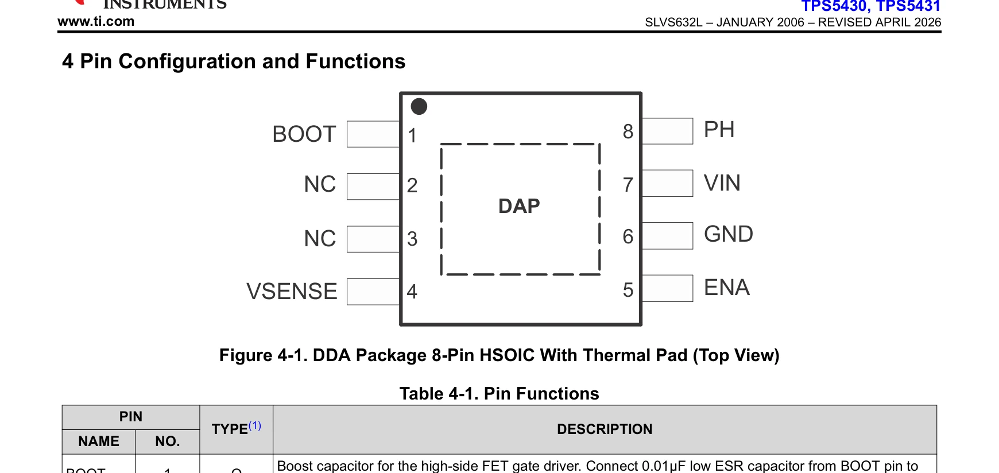
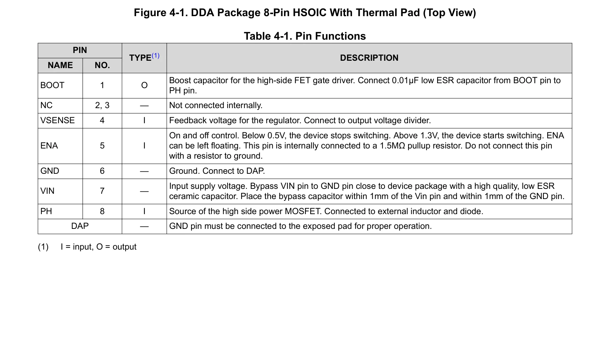
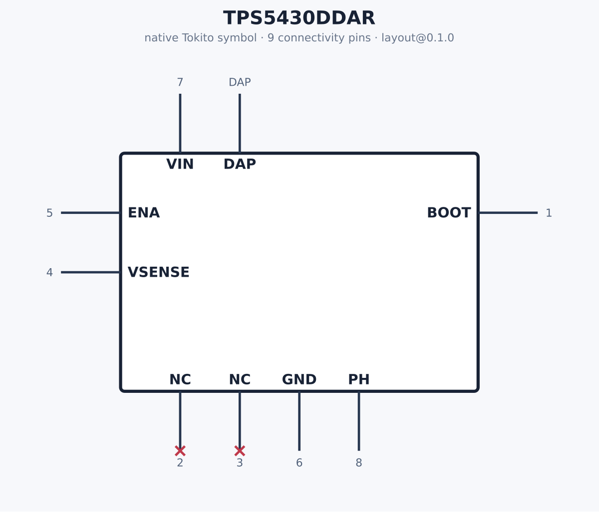

# Real retrieval example: TPS5430DDAR

This is an actual output from the deterministic DS-ViRe baseline, not a drawn
mockup. The input was Texas Instruments' 41-page **TPS5430/TPS5431 3-A,
wide-input-range, step-down converter** datasheet (revision L), identified by
SHA-256:

```text
83074fc1265c8e5c6639511bdb9f83e96c6e6f993613deadea0d09c3a12a2c07
```

Input identity:

| Field | Value |
|---|---|
| Manufacturer | Texas Instruments |
| MPN | TPS5430DDAR |
| Package | SO-PowerPAD-8 |
| Source | [TI product datasheet](https://www.ti.com/lit/ds/symlink/tps5430.pdf) |
| Retrieval version | `dsvire-baseline@0.1.0` |

DS-ViRe selected page 3 and independently verified both required evidence
classes. The complete machine-readable result is in
[`evidence.json`](../../artifacts/83074fc1265c8e5c6639511b/evidence.json).

## Pinout evidence

- Region: `r_pinout_01`
- Page: 3
- Normalized bounding box: `[0.035, 0.059441, 0.965, 0.399441]`
- Verification confidence: `1.0`
- Crop SHA-256: `a76dd05768f97be9a1c6f3ee1b218407a330813b04398f7d33674056466d7587`



## Pin-function table evidence

- Region: `r_pin_table_01`
- Page: 3
- Normalized bounding box: `[0.035, 0.300201, 0.965, 0.720201]`
- Verification confidence: `1.0`
- Crop SHA-256: `9d110a02405377acbc15b74400124f2606936fc1b7c6875e6cb1241d87374922`



## Generated native Tokito symbol

The two crops above were transcribed into a complete
[`tokito.symbol-spec.v1`](../../artifacts/83074fc1265c8e5c6639511b/spec.json),
then passed to the real deterministic `tokito-catalog` compiler. The compiler
emitted [`symbol.tokito_sym`](../../artifacts/83074fc1265c8e5c6639511b/symbol.tokito_sym)
and parsed its own output back successfully with all nine connectivity entries
preserved.



| Number | Name | Tokito electrical type | Evidence |
|---|---|---|---|
| 1 | BOOT | `output` | pinout + pin table |
| 2 | NC | `no_connect` | pinout + pin table |
| 3 | NC | `no_connect` | pinout + pin table |
| 4 | VSENSE | `input` | pinout + pin table |
| 5 | ENA | `input` | pinout + pin table |
| 6 | GND | `power_in` | pinout + pin table |
| 7 | VIN | `power_in` | pinout + pin table |
| 8 | PH | `power_out` | pinout + pin table |
| DAP | DAP | `power_in` | pinout + pin table |

The datasheet names the exposed thermal pad `DAP` but does not assign it a
numeric pin. The symbol therefore preserves `DAP` as its connectivity key and
leaves `Footprint` empty. A package-specific footprint review must decide
whether a target footprint numbers that pad `9`, `EP`, or another value; this
proof deliberately does not invent that mapping.

Extraction provenance is explicit: this checked-in proof is a reviewed visual
transcription of the real crops (`tokito-dsvire.reviewed-crop-transcription@0.1.0`),
not a concealed canned model response. The production `tokito-ai` extractor can
replace that stage when a vision-model credential is configured; compilation
and validation remain identical.

### Verification

[`verification.json`](../../artifacts/83074fc1265c8e5c6639511b/verification.json)
records 18 passing checks:

- evidence schema, verified pinout/table, and ordered bounding boxes;
- exact manufacturer, MPN, package, datasheet id, and PDF hash continuity;
- all nine unique pins above the confidence floor, with all 18 region citations resolved;
- native symbol existence and canonical identity properties.

Artifact SHA-256 values:

| Artifact | SHA-256 |
|---|---|
| `spec.json` | `b68229b708969b27cfd75829b8285a78f5f5763a27924ea4f6126229f0ad96cb` |
| `symbol.tokito_sym` | `a55f281a9c5316046c892e406b93323d934f198fe9270beedd73f561f4a519bb` |
| `TPS5430DDAR.svg` | `43db2b351be5d36d1f883cb5d1b1a52c85f41af107c2f7a236dfeaeac3dba20f` |
| `TPS5430DDAR.png` | `7cf3871b6515bda1eb4890ace31da687447d1e721d7ba80c7462305ae4ee7848` |

## Reproduce

The manufacturer PDF is deliberately not committed. Download it from the
source link and run:

```bash
python -m pip install -e '.[test]'
dsvire extract-evidence tps5430.pdf \
  --manufacturer 'Texas Instruments' \
  --mpn TPS5430DDAR \
  --package SO-PowerPAD-8 \
  --source-url 'https://www.ti.com/lit/ds/symlink/tps5430.pdf' \
  --out artifacts

cargo run --locked \
  --manifest-path ../tokito-catalog/Cargo.toml \
  --bin tokito-symbol-compile -- \
  --spec artifacts/83074fc1265c8e5c6639511b/spec.json \
  --out artifacts/83074fc1265c8e5c6639511b/symbol.tokito_sym

python scripts/render_tokito_sym.py \
  artifacts/83074fc1265c8e5c6639511b/symbol.tokito_sym \
  artifacts/83074fc1265c8e5c6639511b/TPS5430DDAR.svg

rsvg-convert -w 1200 \
  -o artifacts/83074fc1265c8e5c6639511b/TPS5430DDAR.png \
  artifacts/83074fc1265c8e5c6639511b/TPS5430DDAR.svg

python scripts/verify.py 83074fc1265c8e5c6639511b \
  --bundle artifacts/83074fc1265c8e5c6639511b/evidence.json \
  --compiled-only \
  --out artifacts/83074fc1265c8e5c6639511b/verification.json
```

The two displayed crops are limited excerpts used to demonstrate retrieval and
provenance. Texas Instruments retains ownership of the source datasheet; the
complete PDF is not redistributed by this repository.
